# GraphViz Update Summary - Phases 1-3

**Date**: 2025-10-15
**Status**: Analysis Complete, Updates Required

---

## Current Status of GraphViz Files

### Phase 1: `phases/phase1/graphviz/phase-flow.dot`
**Status**: ❌ **OUTDATED** - Missing TRM × Titans-MAG architecture
**Current**: Shows "TinyTitanModel" with ACT + LTM
**Should Show**: TRM wrapper + Titans-MAG backbone + Muon × Grokfast

**Key Missing Elements**:
- TRM (Test-time Reasoning Model) wrapper showing multi-pass reasoning
- Titans-MAG backbone (8 layers, not 12)
- MAG gate (Memory Attention Gating)
- Muon × Grokfast optimizer with Phase 1 config (lr=1e-3, lambda=0.3)
- Distinction between 3 specialized models (reasoning, memory, speed)

### Phase 2: `phases/phase2/graphviz/phase-flow.dot`
**Status**: ✅ **MOSTLY CORRECT** - Shows binary pairing strategy
**Current**: Shows 8 binary combinations, evolution loop, tournament selection
**Minor Updates Needed**: Add note that Phase 2 doesn't use Muon × Grokfast (only merging, no gradient updates)

**Strengths**:
- Binary combination strategy clearly shown (2³ = 8 models)
- 3 mutually exclusive pairs well-documented
- Evolution loop with tournament selection
- Diversity injection
- Success criteria

### Phase 3: `phases/phase3/graphviz/phase-flow.dot`
**Status**: ❌ **COMPLETELY WRONG** - Missing two-step process
**Current**: Shows only Quiet-STaR (thought generation + anti-theater)
**Should Show**: **STEP 1: Prompt Baking** → **STEP 2: Quiet-STaR**

**Critical Missing Elements**:
- Entire Step 1 (Prompt Baking) is missing!
- Frontier model data generation (OpenRouter API)
- 20,000 examples from 5 frontier models
- 16 special tokens (updated from 8)
- 11 reasoning patterns (4 foundational + 7 advanced) **[NEW USER REQUIREMENT]**
- Muon × Grokfast supervised config for baking (lr=1e-4, lambda=0.2)
- Muon × Grokfast RL config for Quiet-STaR (lr=5e-4, lambda=0.1, QK-clip=25.0, KL-reg=0.1)
- Convergence validation (85% threshold)
- Jumpstart effect (baking → RL)

---

## User's New Phase 3 Requirement: 11 Reasoning Patterns

### 4 Foundational Patterns (NEW)
1. **Thinking Token Usage**: Basic `<think>...</think>` wrapping
2. **Chain-of-Thought**: Step-by-step breakdown
3. **Self-Correction**: Question and correct mistakes
4. **Uncertainty Expression**: Confidence levels

### 7 Advanced Strategies (EXISTING)
5. **MECE Decomposition**: Mutually exclusive, collectively exhaustive
6. **Falsification Testing**: "What would prove me wrong?"
7. **Expert Perspective**: Domain expert thinking
8. **Orthogonal Wisdom**: Insights from unrelated fields
9. **Self-Doubt**: "Could I be wrong?"
10. **Bayesian Rationalist**: Update beliefs on evidence
11. **Multidomain Consultant**: Synthesize multiple expert views

### Key Innovation: COMBINABLE PATTERNS

**User's Critical Insight**:
> "allow combos of all of them so a thought may begin and end and contain chain of thought and mece and expert"

**Example Combined Thought**:
```
<think>
  # Foundational: Chain-of-thought structure
  <step>Let me break this down systematically</step>

  # Advanced: MECE decomposition
  <mece>Categories: Technical, Business, User Experience</mece>

  # Advanced: Expert perspective
  <expert>From a senior architect's view...</expert>

  # Foundational: Self-correction
  Wait, I initially missed the security aspect. Let me reconsider...

  # Foundational: Uncertainty
  I'm confident about the technical approach (90%) but less certain about
timing (60%)
</think>
```

This means:
- **Not 11 separate pattern types**
- **11 patterns that can be MIXED in a single thought**
- Training data should include:
  - Pure examples (single pattern)
  - Combined examples (2-3 patterns)
  - Complex examples (4+ patterns)

---

## Impact on Special Token Count

### Current (from phase3_data_generator.py):
16 special tokens (deduplicated from 8 strategies × 2 tokens each)

### Updated (with 11 patterns):
Need to add 4 foundational patterns' tokens:
- `<think>`, `</think>` (already counted)
- `<step>`, `</step>` (already counted)
- `<reason>`, `</reason>` (already counted)
- `<correct>`, `</correct>` (NEW)
- `<uncertain>`, `</uncertain>` (NEW)

**New Total**: ~20 special tokens (exact count TBD after deduplication)

---

## Required Updates

### 1. Phase 1 GraphViz (`phases/phase1/graphviz/phase-flow.dot`)

**Major Changes Needed**:
```dot
// Add architecture initialization section
arch_setup [label="Initialize TRM × Titans-MAG\n━━━━━━━━━━━━━━━━━━━━━━━━\n
• Titans-MAG Backbone (8 layers, 512 dim)\n
• TRM Wrapper (multi-pass reasoning)\n
• ACT Head (adaptive computation)\n
• MAG Gate (memory gating)"]

// Add Muon × Grokfast section
optimizer_setup [label="Initialize Muon × Grokfast\n━━━━━━━━━━━━━━━━━━━━━━━━\n
Phase 1 Config:\n
• muon_lr = 1e-3\n
• grokfast_lambda = 0.3\n
• qk_clip_threshold = 30.0\n
• kl_coefficient = 0.0"]
```

**Success Criteria Update**:
```
✅ TRM × Titans-MAG architecture working
✅ Muon × Grokfast (Phase 1 config) used
✅ 3 specialized models (reasoning, memory, speed)
```

### 2. Phase 2 GraphViz (`phases/phase2/graphviz/phase-flow.dot`)

**Minor Update**:
Add note box:
```dot
no_optimizer [label="Note: Phase 2 Uses No Optimizer\n━━━━━━━━━━━━━━━━━━━━━━━━━━━\n
Phase 2 is pure model merging (no gradients).\n
Muon × Grokfast not used in this phase.\n
\n
Evolution via:\n
• Merge technique combinations\n
• Tournament selection\n
• Weight perturbation (not gradient-based)"]
```

### 3. Phase 3 GraphViz (`phases/phase3/graphviz/phase-flow.dot`)

**Complete Rewrite Needed** - Two-step process:

```dot
digraph Phase3_PromptBaking_QuietSTaR_TwoStep {
  // STEP 1: PROMPT BAKING
  step1_title [label="STEP 1: PROMPT BAKING (Foundation)"]

  data_gen [label="Generate Training Data\n━━━━━━━━━━━━━━━━━━━━━\n
  5 Frontier Models (OpenRouter):\n
  • GPT-4o\n
  • Claude 3.5 Sonnet\n
  • Gemini Pro 1.5\n
  • Grok Beta\n
  • Qwen 2.5 72B\n
  \n
  20,000 examples total\n
  500 examples per model per pattern"]

  patterns [label="11 Reasoning Patterns\n━━━━━━━━━━━━━━━━━━━━\n
  FOUNDATIONAL (4):\n
  1. Thinking Token Usage\n
  2. Chain-of-Thought\n
  3. Self-Correction\n
  4. Uncertainty Expression\n
  \n
  ADVANCED (7):\n
  5. MECE Decomposition\n
  6. Falsification Testing\n
  7. Expert Perspective\n
  8. Orthogonal Wisdom\n
  9. Self-Doubt\n
  10. Bayesian Rationalist\n
  11. Multidomain Consultant\n
  \n
  **KEY**: Patterns can be COMBINED\n
  in single thoughts!"]

  special_tokens [label="Add 20 Special Tokens\n━━━━━━━━━━━━━━━━━━━━\n
  <think>, </think>\n
  <step>, </step>\n
  <reason>, </reason>\n
  <mece>, </mece>\n
  <falsify>, </falsify>\n
  <expert>, </expert>\n
  <orthogonal>, </orthogonal>\n
  <doubt>, </doubt>\n
  <bayesian>, </bayesian>\n
  <multidomain>, </multidomain>\n
  <correct>, </correct>\n
  <uncertain>, </uncertain>\n
  + 8 more..."]

  baking_train [label="Prompt Baking Training\n━━━━━━━━━━━━━━━━━━━━━━\n
  Optimizer: Muon × Grokfast\n
  • muon_lr = 1e-4 (supervised)\n
  • grokfast_lambda = 0.2\n
  • qk_clip_threshold = 30.0\n
  • kl_coefficient = 0.0\n
  \n
  Epochs: 5\n
  Trajectories: 20,000\n
  Method: KL divergence minimization"]

  validate_baking [label="Validate Convergence\n━━━━━━━━━━━━━━━━━━━\n
  Threshold: ≥85% accuracy\n
  \n
  Check:\n
  • Thinking token usage >80%\n
  • Pattern usage >60% (appropriate)\n
  • Combined patterns working\n
  • No mode collapse"]

  // STEP 2: QUIET-STAR
  step2_title [label="STEP 2: QUIET-STAR (RL on Baked Foundation)"]

  generate_thoughts [label="Generate Structured Thoughts\n━━━━━━━━━━━━━━━━━━━━━━━━━━\n
  4-8 parallel thoughts per position\n
  \n
  **NOW uses baked patterns:**\n
  Thoughts naturally contain:\n
  • <think> tags\n
  • Chain-of-thought steps\n
  • Self-correction\n
  • Combined patterns\n
  \n
  (vs. without baking: 'and then 5')"]

  coherence_scoring [label="Score Coherence\n━━━━━━━━━━━━━━━━\n
  Semantic: 40%\n
  Syntactic: 30%\n
  Predictive: 30%"]

  mixing_head [label="Mixing Head\n━━━━━━━━━━━━━\n
  Attention-based fusion\n
  Weight by coherence scores"]

  quietstar_train [label="Quiet-STaR RL Training\n━━━━━━━━━━━━━━━━━━━━━━━\n
  Optimizer: Muon × Grokfast\n
  • muon_lr = 5e-4 (RL higher)\n
  • grokfast_lambda = 0.1 (RL filtering)\n
  • qk_clip_threshold = 25.0 (RL tighter)\n
  • kl_coefficient = 0.1 (prevent drift)\n
  \n
  Method: REINFORCE\n
  Reward: Correct prediction"]

  antitheater [label="Anti-Theater Validation\n━━━━━━━━━━━━━━━━━━━━━━━\n
  Test 1: Divergence >0.3\n
  Test 2: Ablation (with > without)\n
  Test 3: Correlation >0.5"]

  // Flow
  step1_title -> data_gen
  data_gen -> patterns
  patterns -> special_tokens
  special_tokens -> baking_train
  baking_train -> validate_baking

  validate_baking -> step2_title
  step2_title -> generate_thoughts
  generate_thoughts -> coherence_scoring
  coherence_scoring -> mixing_head
  mixing_head -> quietstar_train
  quietstar_train -> antitheater
}
```



---

## Action Items

### High Priority (Breaks Implementation)
1. ❌ **Rewrite Phase 3 GraphViz** - Two-step process with 11 patterns
2. ❌ **Update phase3_data_generator.py** - Add 4 foundational patterns
3. ❌ **Update PHASE3_PROMPT_BAKING_CORRECTED.md** - Document pattern combinations
4. ❌ **Update Phase 1 GraphViz** - TRM × Titans-MAG + Muon × Grokfast
5. ❌ **Fix LOGICAL_UNDERSTANDING.md** - 20 special tokens (not 16), "3 models" (not "1 model")

### Medium Priority
6. ❌ **Update Phase 2 GraphViz** - Add "no optimizer" note
7. ❌ **Create pattern combination examples** - Show how to mix 2-4 patterns
8. ❌ **Update data generation prompts** - Request combined pattern examples

### Documentation
9. ❌ **Create MUGROKFAST_PHASE_CONFIGS.md** - Centralized config comparison
10. ❌ **Update PHASE3_DATA_GENERATION_GUIDE.md** - 11 patterns, combinations

---

## Next Steps

**Immediate** (this session):
1. Update all 3 GraphViz files with corrected architectures
2. Update Phase 3 data generator with 11 patterns + combinations
3. Fix documentation inconsistencies

**Future** (next session):
1. Generate combined-pattern training data
2. Implement pattern combination logic
3. Test baking with mixed patterns

---

**Document Version**: 1.0.0
**Status**: Analysis Complete, Ready for Implementation
**Impact**: Critical - Current GraphViz files don't match actual architecture
