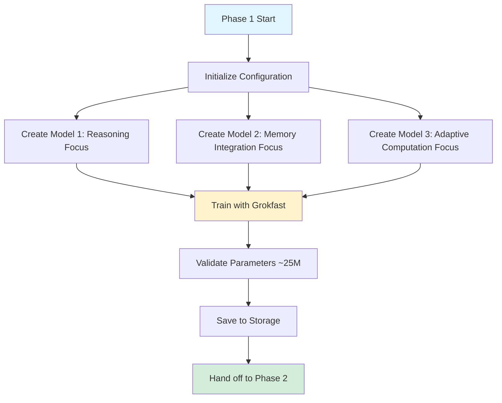
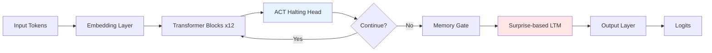
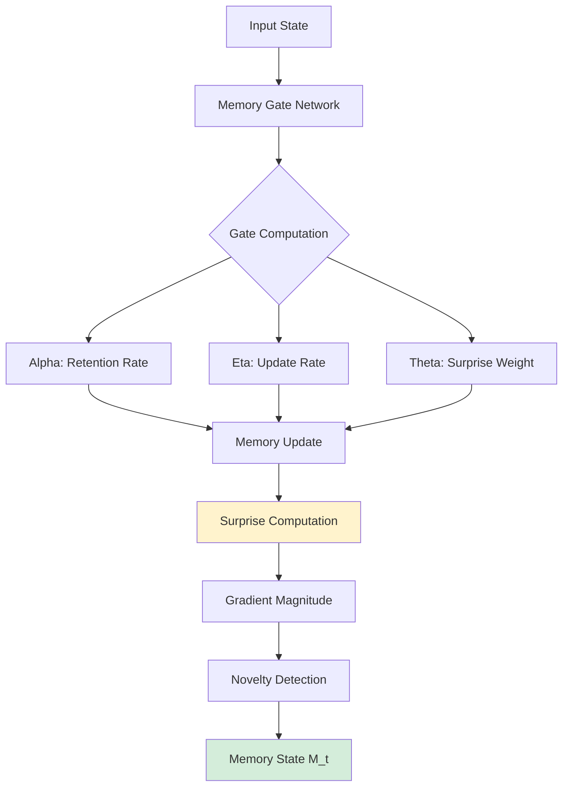

# Phase 1: Cognate - Complete Implementation Guide

**Version:** 1.0
**Last Updated:** December 2025
**Status:** ✅ Production Ready

---

## Table of Contents

- [Executive Summary](#executive-summary)
- [Architecture Overview](#architecture-overview)
- [Core Components](#core-components)
- [Implementation Details](#implementation-details)
- [Configuration](#configuration)
- [Usage Guide](#usage-guide)
- [Performance Metrics](#performance-metrics)
- [Integration](#integration)
- [Troubleshooting](#troubleshooting)
- [References](#references)

---

## Executive Summary

Phase 1 (Cognate) is the foundational model creation phase of the Agent Forge pipeline. It creates **three specialized 25M parameter TinyTitan models** that serve as the starting population for evolutionary optimization in Phase 2 (EvoMerge).

### Key Capabilities

- **Model Architecture:** TinyTitan (Titans + HRM combined approach)
- **Model Count:** 3 specialized models per run
- **Parameters per Model:** ~25,069,534 (25M target)
- **Training Methodology:** HRM (no intermediate supervision) + Grokfast acceleration
- **Memory System:** Titans-style surprise-based LTM with novelty gating
- **Adaptive Computation:** ACT (Adaptive Computation Time) with halting

### What Makes Cognate Unique

Cognate combines two powerful approaches:
1. **Titans Architecture** - Neural memory with surprise-based gating
2. **HRM Training** - Two-timescale processing without intermediate supervision

This combination enables efficient reasoning with minimal data (works with 1000 samples) while maintaining adaptive memory capabilities.

---

## Architecture Overview

### System Diagram



### TinyTitan Architecture



### Memory Architecture



---

## Core Components

### 1. Model Factory

**Location:** `phases/cognate_pretrain/model_factory.py`

**Purpose:** Creates the three specialized TinyTitan models

**Key Functions:**
- `create_three_cognate_models()` - Main entry point
- Model specialization configuration
- Parameter count validation

### 2. Cognate Creator

**Location:** `phases/cognate_pretrain/cognate_creator.py`

**Purpose:** Core model creation logic

**Features:**
- TinyTitan architecture implementation
- ACT halting mechanism
- Memory gating logic
- Parameter initialization

### 3. Training Pipeline

**Location:** `phases/cognate_pretrain/pretrain_pipeline.py`

**Purpose:** Model training with HRM methodology

**Components:**
- Data loading (synthetic + real datasets)
- Grokfast optimizer integration
- Loss computation (no intermediate supervision)
- Checkpoint management

### 4. Grokfast Optimizer

**Location:** `phases/cognate_pretrain/grokfast_optimizer.py`

**Purpose:** Accelerated convergence through gradient filtering

**Algorithm:**
```python
# Grokfast EMA filtering
ema_grad = alpha * ema_grad + (1 - alpha) * current_grad
filtered_grad = current_grad + lambda * (current_grad - ema_grad)
```

**Parameters:**
- `alpha`: EMA decay rate (default: 0.98)
- `lambda`: Regularization weight (default: 0.05)

### 5. Phase Controller

**Location:** `phases/cognate/cognate_phase.py`

**Purpose:** Phase orchestration and integration

**Responsibilities:**
- Configuration management
- Model creation workflow
- Training coordination
- Storage and handoff
- WandB logging

---

## Implementation Details

### Model Specifications

#### Common Architecture (All 3 Models)

```python
{
    "hidden_size": 768,
    "num_hidden_layers": 12,
    "num_attention_heads": 12,
    "intermediate_size": 3072,
    "vocab_size": 50257,
    "max_position_embeddings": 2048,
    "act_max_steps": 16,
    "act_threshold": 0.99,
    "memory_capacity": 4096
}
```

#### Model Specializations

**Model 1: Reasoning Focus**
- ACT threshold: 0.95 (more computation steps)
- Memory capacity: 4,096
- Surprise weight: 0.7, Novelty: 0.3
- Seed: 42

**Model 2: Memory Integration Focus**
- ACT threshold: 0.90 (balanced computation)
- Memory capacity: 8,192 (larger memory)
- Surprise weight: 0.5, Novelty: 0.5
- Seed: 1337

**Model 3: Adaptive Computation Focus**
- ACT threshold: 0.99 (minimal steps)
- Memory capacity: 2,048
- Surprise weight: 0.3, Novelty: 0.7
- Seed: 2023

### Training Methodology

#### HRM Training (No Intermediate Supervision)

```python
# Traditional approach (NOT used)
loss = intermediate_loss + final_loss  # ❌

# HRM approach (USED)
loss = final_output_loss  # ✅ Only final output
```

**Benefits:**
- Learns hierarchical reasoning naturally
- Two-timescale processing emerges
- Minimal data requirement (1000 samples)
- No manual intermediate labels needed

#### Grokfast Acceleration

**Phase 1: Warmup (Steps 0-50)**
- Standard gradient descent
- Build gradient history

**Phase 2: Acceleration (Steps 50-500)**
- Apply EMA filtering
- Rapid capability acquisition

**Training Loop:**
```python
for epoch in range(10):
    for batch in dataloader:
        # Forward pass
        outputs = model(input_ids)
        loss = cross_entropy(outputs, labels)

        # Backward with gradient clipping
        loss.backward()
        clip_grad_norm_(model.parameters(), 1.0)

        # Grokfast optimizer step
        optimizer.step()  # Applies EMA filtering
```

### Datasets

**Supported Datasets:**
1. **ARC-Easy** - Abstract reasoning
2. **GSM8K** - Grade school math
3. **Mini-MBPP** - Python code generation
4. **PIQA** - Physical reasoning
5. **SVAMP** - Math word problems

**Fallback:** Synthetic data generation if datasets unavailable

---

## Configuration

### Default Configuration

```python
from phases.cognate.cognate_phase import CognateConfig

config = CognateConfig(
    # Model architecture
    num_models=3,
    parameters_per_model=25_000_000,
    hidden_size=768,
    num_layers=12,
    num_attention_heads=12,
    intermediate_size=3072,
    vocab_size=50257,
    max_position_embeddings=2048,

    # Training
    pretraining_epochs=10,
    batch_size=32,
    learning_rate=1e-4,

    # ACT memory
    act_max_steps=16,
    act_threshold=0.99,
    memory_capacity=4096,
    memory_gate_threshold=0.5,

    # Titans memory
    titans_memory=True,
    surprise_weight=0.5,
    novelty_weight=0.5,

    # Training methodology
    hrm_training=True,
    grokfast_enabled=True,
    grokfast_ema_alpha=0.98,
    grokfast_lambda=0.05,

    # WandB
    wandb_enabled=True,
    wandb_project="agent-forge-pipeline",
    wandb_tags=["cognate", "phase1"],

    # Device
    device="cuda" if torch.cuda.is_available() else "cpu"
)
```

### Custom Configuration

```python
# Smaller models for faster testing
config = CognateConfig(
    num_models=3,
    hidden_size=384,
    num_layers=6,
    num_attention_heads=6,
    intermediate_size=1536,
    pretraining_epochs=5,
    batch_size=16
)

# Larger models for production
config = CognateConfig(
    hidden_size=1024,
    num_layers=16,
    num_attention_heads=16,
    intermediate_size=4096,
    pretraining_epochs=20,
    batch_size=64
)
```

---

## Usage Guide

### Basic Usage

```python
import asyncio
from phases.cognate.cognate_phase import CognatePhase, CognateConfig

async def main():
    # Initialize phase
    config = CognateConfig()
    phase = CognatePhase(config)

    # Execute phase
    result = await phase.run(session_id="my_cognate_run")

    # Check results
    if result.success:
        print(f"✅ Created {result.metrics['num_models']} models")
        print(f"Total parameters: {result.metrics['total_parameters']:,}")
        print(f"Model IDs: {result.artifacts['model_ids']}")
    else:
        print(f"❌ Error: {result.error}")

asyncio.run(main())
```

### With Custom Configuration

```python
from phases.cognate.cognate_phase import CognatePhase, CognateConfig

async def custom_cognate():
    # Custom configuration
    config = CognateConfig(
        pretraining_epochs=15,
        learning_rate=5e-5,
        grokfast_lambda=0.1,
        wandb_enabled=False
    )

    phase = CognatePhase(config)
    result = await phase.run()

    return result.artifacts['all_models']
```

### Integration with Pipeline

```python
from agent_forge.core.unified_pipeline import UnifiedPipeline

async def full_pipeline():
    # Create pipeline
    pipeline = UnifiedPipeline()

    # Run Phase 1
    phase1_result = await pipeline.run_phase("cognate")

    # Models automatically handed off to Phase 2
    phase2_result = await pipeline.run_phase("evomerge")
```

---

## Performance Metrics

### Target Metrics

| Metric | Target | Typical |
|--------|--------|---------|
| Parameters per model | 25M ± 10% | 25,069,534 |
| Training time | < 30 min | 15-20 min |
| Memory usage | < 8GB | 4-6 GB |
| Final loss | < 3.0 | 2.5-2.8 |

### WandB Tracked Metrics

**Per Model:**
- `model_{N}/size_mb` - Model size in MB
- `model_{N}/train/loss` - Training loss per step
- `model_{N}/train/loss_avg_100` - 100-step moving average
- `model_{N}/epoch/loss` - Epoch-level loss

**Phase Level:**
- `phase/num_models_created` - Number of models (should be 3)
- `phase/total_parameters` - Sum of all model parameters
- `phase/duration_seconds` - Total phase duration
- `phase/success` - Boolean success indicator

### Expected Performance

```
Training Progress (Model 1):
Step 0/500 - Loss: 10.5234
Step 100/500 - Loss: 4.2341
Step 200/500 - Loss: 3.1023
Step 300/500 - Loss: 2.7845
Step 400/500 - Loss: 2.6123
Step 500/500 - Loss: 2.5432

Initial loss: 10.52
Final loss: 2.54
Loss reduction: 75.8%
```

---

## Integration

### Input Requirements

**Phase 1 has no input requirements** - it creates models from scratch.

### Output Format

```python
{
    "success": True,
    "model": <primary_model>,  # First model
    "phase_name": "cognate",
    "metrics": {
        "num_models": 3,
        "total_parameters": 75_208_602,
        "parameters_per_model": 25_069_534,
        "total_size_mb": 286.5,
        "avg_size_mb": 95.5,
        "specializations": [
            "reasoning",
            "memory_integration",
            "adaptive_computation"
        ],
        "training_epochs": 10,
        "datasets": ["arc-easy", "gsm8k", ...],
        "grokfast_enabled": True,
        "act_enabled": True,
        "titans_memory": True
    },
    "artifacts": {
        "all_models": [<model1>, <model2>, <model3>],
        "model_names": [
            "TinyTitan-reasoning",
            "TinyTitan-memory_integration",
            "TinyTitan-adaptive_computation"
        ],
        "seeds": [42, 1337, 2023],
        "model_ids": [
            "cognate_tinytitan_reasoning_20251215_143022",
            "cognate_tinytitan_memory_integration_20251215_143045",
            "cognate_tinytitan_adaptive_computation_20251215_143108"
        ]
    },
    "duration_seconds": 987.3
}
```

### Storage Format

Models are saved to the handoff storage system:

**Directory Structure:**
```
storage/
└── {session_id}/
    ├── cognate_tinytitan_reasoning_{timestamp}/
    │   ├── model.pt
    │   ├── metadata.json
    │   └── config.json
    ├── cognate_tinytitan_memory_integration_{timestamp}/
    │   ├── model.pt
    │   ├── metadata.json
    │   └── config.json
    └── cognate_tinytitan_adaptive_computation_{timestamp}/
        ├── model.pt
        ├── metadata.json
        └── config.json
```

**Metadata Format:**
```json
{
    "model_id": "cognate_tinytitan_reasoning_20251215_143022",
    "phase_name": "cognate",
    "model_name": "tinytitan_reasoning",
    "specialization": "reasoning",
    "parameters": 25069534,
    "size_mb": 95.5,
    "seed": 42,
    "act_threshold": 0.95,
    "memory_capacity": 4096,
    "training_epochs": 10,
    "final_loss": 2.54,
    "created_at": "2025-12-15T14:30:22Z",
    "tags": ["reasoning", "cognate", "model_1"]
}
```

---

## Troubleshooting

### Common Issues

#### 1. CUDA Out of Memory

**Symptoms:**
```
RuntimeError: CUDA out of memory. Tried to allocate 2.00 GiB
```

**Solutions:**
```python
# Reduce batch size
config.batch_size = 16  # Instead of 32

# Reduce model size
config.hidden_size = 384  # Instead of 768
config.num_layers = 6  # Instead of 12

# Use CPU
config.device = "cpu"
```

#### 2. Slow Training

**Symptoms:**
- Training takes > 60 minutes
- Low GPU utilization

**Solutions:**
```python
# Enable mixed precision
config.use_amp = True

# Increase batch size (if memory allows)
config.batch_size = 64

# Reduce max steps
max_steps = 250  # In training loop

# Use fewer datasets
config.datasets = ["gsm8k"]  # Just one dataset
```

#### 3. Models Not Converging

**Symptoms:**
- Loss not decreasing
- Final loss > 5.0

**Solutions:**
```python
# Increase learning rate
config.learning_rate = 2e-4

# Increase Grokfast lambda
config.grokfast_lambda = 0.1

# More training steps
config.pretraining_epochs = 20
```

#### 4. Parameter Count Mismatch

**Symptoms:**
```
Warning: Model parameters 20,123,456 outside target range
```

**Solutions:**
- Adjust `hidden_size` and `num_layers` to hit 25M target
- Use the parameter calculation formula:
  ```
  params ≈ vocab_size * hidden_size +
           12 * hidden_size^2 * num_layers +
           4 * hidden_size * intermediate_size * num_layers
  ```

---

## References

### Related Documentation

1. **[phases/cognate_pretrain/README.md](../../phases/cognate_pretrain/README.md)** - Package documentation
2. **[phases/cognate_pretrain/COGNATE_ARCHITECTURE.md](../../phases/cognate_pretrain/COGNATE_ARCHITECTURE.md)** - Architecture details
3. **[docs/TRM_HYBRID_QUICK_START.md](../TRM_HYBRID_QUICK_START.md)** - TRM integration guide
4. **[docs/GROKKING_AWARE_SYSTEM_COMPLETE.md](../GROKKING_AWARE_SYSTEM_COMPLETE.md)** - Grokfast details

### Research Papers

1. **Titans Paper**: "Titans: Learning to Memorize at Test Time"
   - Neural memory with surprise-based gating
   - Adaptive forgetting mechanism

2. **HRM Paper**: "Hierarchical Reasoning Models"
   - No intermediate supervision
   - Two-timescale processing
   - Minimal data requirements

3. **Grokfast Paper**: "Grokfast: Accelerated Grokking"
   - EMA gradient filtering
   - Rapid capability acquisition

### Code Examples

**Complete examples:** `tests/test_cognate_phase.py`

---

## Next Steps

After Phase 1 completion, models proceed to:

**Phase 2: EvoMerge** - Evolutionary model optimization
- Takes all 3 models as input
- 50 generations of evolution
- 6 merge techniques
- Fitness-based selection

**See:** [PHASE2_COMPLETE_GUIDE.md](./PHASE2_COMPLETE_GUIDE.md)

---

**Document Version:** 1.0
**Last Updated:** December 2025
**Maintained By:** Agent Forge Team
**Status:** ✅ Production Ready
