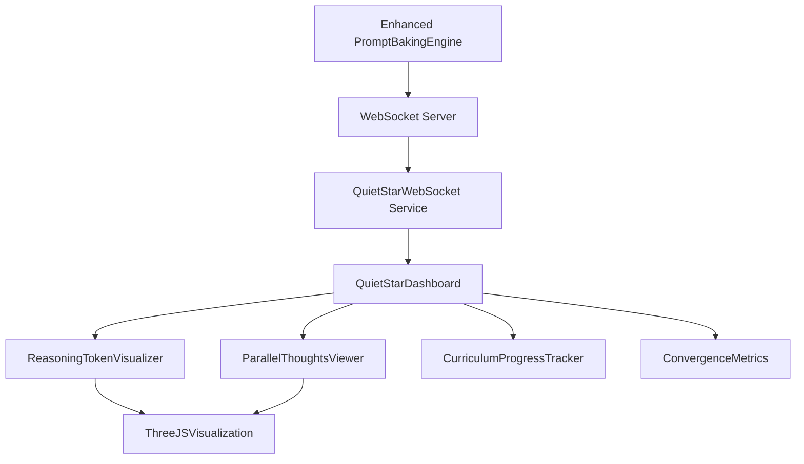

# Phase 3: Quiet Star Visualization UI

## Overview

The Phase 3 Quiet Star Visualization UI provides comprehensive real-time monitoring and visualization of the enhanced Quiet Star reasoning implementation. This system displays reasoning token streams, parallel thought processes, curriculum learning progress, and convergence metrics through an interactive dashboard.

## Architecture

### Core Components

#### 1. QuietStarDashboard
**Main container component that orchestrates all visualization elements**

- **Location**: `src/ui/components/QuietStarDashboard.tsx`
- **Purpose**: Central control and coordination of all Quiet Star visualizations
- **Features**:
  - Configuration management (streams, temperature, thought length)
  - Real-time WebSocket integration
  - Performance metrics summary
  - Responsive layout management
  - Mobile-optimized controls

#### 2. ReasoningTokenVisualizer
**Displays reasoning token streams with `<|startofthought|>` / `<|endofthought|>` sequences**

- **Location**: `src/ui/components/ReasoningTokenVisualizer.tsx`
- **Purpose**: Visualize individual reasoning tokens and thought boundaries
- **Features**:
  - 2D and 3D visualization modes
  - Token type highlighting (start, content, end, regular)
  - Confidence score visualization
  - Interactive token selection
  - Thought group analysis
  - Stream comparison

#### 3. ParallelThoughtsViewer
**3D visualization of 4-stream parallel reasoning generation**

- **Location**: `src/ui/components/ParallelThoughtsViewer.tsx`
- **Purpose**: Display parallel thought streams in interactive 3D space
- **Features**:
  - Real-time 3D particle systems
  - Stream interaction visualization
  - Physics-based movement
  - Interactive camera controls (orbit, follow, free)
  - Stream convergence analysis
  - Node selection and inspection

#### 4. CurriculumProgressTracker
**Tracks Fast Quiet-STaR 6-stage curriculum learning**

- **Location**: `src/ui/components/CurriculumProgressTracker.tsx`
- **Purpose**: Monitor progression through curriculum learning stages
- **Features**:
  - Six-stage curriculum visualization
  - Real-time progress tracking
  - Performance metrics per stage
  - Thought length range indicators
  - Stage-specific analytics
  - Timeline visualization

#### 5. ConvergenceMetrics
**Performance metrics with Chart.js integration**

- **Location**: `src/ui/components/ConvergenceMetrics.tsx`
- **Purpose**: Display internalization progress and convergence rates
- **Features**:
  - Real-time line charts
  - Radar charts for current performance
  - Historical data analysis
  - Convergence status indicators
  - Detailed sub-metrics
  - Multiple time range views

#### 6. ThreeJSVisualization
**Advanced 3D thought flow visualization**

- **Location**: `src/ui/components/ThreeJSVisualization.tsx`
- **Purpose**: Sophisticated 3D rendering of thought particles and flows
- **Features**:
  - Particle-based thought representation
  - Stream path visualization
  - Interactive 3D controls
  - Physics simulation
  - Real-time performance monitoring
  - Mobile-responsive 3D

### Services Layer

#### QuietStarWebSocket Service
**Real-time communication with Quiet Star engine**

- **Location**: `src/ui/services/QuietStarWebSocket.ts`
- **Purpose**: WebSocket integration for live reasoning updates
- **Features**:
  - Automatic reconnection with exponential backoff
  - Message queuing during disconnections
  - Heartbeat monitoring
  - Type-safe message handling
  - Mock server for development
  - React hook integration (`useQuietStarWebSocket`)

## Technical Specifications

### Data Flow



### WebSocket Message Types

```typescript
interface WebSocketMessage {
  type: 'reasoning_token' | 'stream_update' | 'convergence_update' | 'curriculum_progress';
  data: any;
  timestamp: number;
}

// Reasoning Token Update
{
  type: 'reasoning_token',
  data: {
    id: string;
    content: string;
    type: 'thought_start' | 'thought_content' | 'thought_end' | 'regular';
    position: number;
    timestamp: number;
    confidence: number;
    streamId: number;
  }
}

// Stream Convergence Update
{
  type: 'stream_update',
  data: {
    streamId: number;
    updates: {
      convergenceScore: number;
      isActive: boolean;
      temperature: number;
    }
  }
}
```

### Enhanced Quiet Star Integration

The visualization connects to the enhanced PromptBakingEngine methods:

#### Core Methods
- `generate_thoughts_parallel()` - 4-stream parallel generation
- `fast_quietstar_curriculum()` - 6-stage curriculum learning
- `_evaluate_internalization()` - Convergence assessment

#### Data Sources
- **Reasoning Tokens**: Real-time token generation with confidence scores
- **Stream States**: Active/inactive status, temperature, convergence rates
- **Curriculum Progress**: Stage advancement, performance metrics
- **Convergence Data**: Internalization rates, quality metrics

## Installation & Setup

### Dependencies

Add these to your `package.json`:

```json
{
  "dependencies": {
    "react": "^18.0.0",
    "typescript": "^5.0.0"
  },
  "optionalDependencies": {
    "three": "^0.150.0",
    "chart.js": "^4.0.0"
  }
}
```

### Basic Usage

```tsx
import React from 'react';
import { QuietStarDashboard } from './src/ui/components';

export const App: React.FC = () => {
  return (
    <QuietStarDashboard
      initialConfig={{
        parallelStreams: 4,
        maxThoughtLength: 512,
        temperature: 0.7,
        curriculumEnabled: true,
        visualizationMode: '3d',
        realTimeUpdates: true
      }}
      onConfigChange={(config) => {
        console.log('Configuration updated:', config);
      }}
    />
  );
};
```

### WebSocket Integration

```tsx
import { useQuietStarWebSocket } from './src/ui/services';

const { connect, disconnect, connectionState, isConnected } = useQuietStarWebSocket(
  {
    url: 'ws://localhost:8080/quiet-star',
    reconnectInterval: 5000,
    maxReconnectAttempts: 10
  },
  {
    onReasoningToken: (token) => console.log('New token:', token),
    onConvergenceUpdate: (metrics) => console.log('Convergence update:', metrics)
  }
);
```

## Configuration Options

### QuietStarConfig

```typescript
interface QuietStarConfig {
  parallelStreams: number;        // 1-8 parallel reasoning streams
  maxThoughtLength: number;       // Maximum tokens per thought (64-1024)
  temperature: number;            // Generation temperature (0.1-2.0)
  curriculumEnabled: boolean;     // Enable 6-stage curriculum learning
  visualizationMode: '2d' | '3d'; // Visualization rendering mode
  realTimeUpdates: boolean;       // Enable WebSocket real-time updates
}
```

### CurriculumStage Configuration

```typescript
interface CurriculumStage {
  id: number;                     // Stage identifier (0-5)
  name: string;                   // Stage name
  description: string;            // Stage description
  progress: number;               // Completion percentage (0-100)
  isActive: boolean;              // Currently active stage
  thoughtLength: {                // Token length constraints
    min: number;
    max: number;
    current: number;
  };
  metrics: {                      // Performance metrics
    accuracy: number;
    efficiency: number;
    internalization: number;
  };
}
```

## Visualization Features

### 2D Mode
- Timeline-based token visualization
- Circular stream arrangement
- Real-time particle flows
- Interactive stream selection
- Confidence score indicators

### 3D Mode
- Particle-based thought representation
- Physics-driven movement
- Interactive camera controls
- Depth-based rendering
- Stream interaction visualization

### Interactive Controls
- **Mouse/Touch**: Rotate, zoom, pan
- **Keyboard**: Camera shortcuts
- **Mobile**: Touch gestures, responsive layout
- **Configuration**: Real-time parameter adjustment

## Performance Optimizations

### Rendering
- Canvas-based 2D/3D rendering for performance
- Particle count limiting (configurable)
- Frame rate optimization
- Mobile-specific optimizations

### Data Management
- Efficient token buffering
- Stream state caching
- Memory usage monitoring
- Garbage collection optimization

### Network
- WebSocket connection pooling
- Message queuing during disconnections
- Compression for large datasets
- Heartbeat monitoring

## Development

### Mock Data Generation

For development without a live Quiet Star engine:

```tsx
import { MockQuietStarWebSocket } from './src/ui/services';

const mockWs = new MockQuietStarWebSocket();
mockWs.connect(); // Generates realistic mock data
```

### Testing

```bash
# Unit tests
npm test src/ui/components/

# Integration tests
npm test src/ui/services/

# E2E tests with Playwright
npm run test:e2e
```

### File Structure

```
src/ui/
├── components/
│   ├── QuietStarDashboard.tsx
│   ├── ReasoningTokenVisualizer.tsx
│   ├── ParallelThoughtsViewer.tsx
│   ├── CurriculumProgressTracker.tsx
│   ├── ConvergenceMetrics.tsx
│   ├── ThreeJSVisualization.tsx
│   ├── PhaseController.tsx
│   └── index.ts
├── services/
│   ├── QuietStarWebSocket.ts
│   └── index.ts
├── types/
│   └── phases.ts
└── examples/
    └── QuietStarExample.tsx
```

## Advanced Features

### Real-time Metrics
- Token generation rate monitoring
- Stream convergence tracking
- Curriculum advancement detection
- Performance bottleneck identification

### Interactive Analysis
- Token-level inspection
- Stream comparison tools
- Historical trend analysis
- Export capabilities

### Customization
- Theme system
- Layout configurations
- Metric selection
- Visualization presets

## Troubleshooting

### Common Issues

1. **WebSocket Connection Fails**
   - Check server URL and port
   - Verify CORS settings
   - Enable mock mode for development

2. **Performance Issues**
   - Reduce particle count
   - Lower frame rate
   - Use 2D mode on mobile

3. **Responsive Layout Problems**
   - Check viewport meta tag
   - Verify CSS media queries
   - Test on multiple devices

### Debugging

Enable debug mode:

```typescript
const config = {
  debug: true,
  logLevel: 'verbose'
};
```

Monitor performance:

```typescript
const metrics = usePerformanceMonitoring();
console.log('Render time:', metrics.frameTime);
```

## Production Deployment

### Build Optimization

```bash
# Production build
npm run build

# Bundle analysis
npm run analyze

# Performance testing
npm run lighthouse
```

### Server Configuration

```nginx
# WebSocket proxy
location /quiet-star {
    proxy_pass http://backend:8080;
    proxy_http_version 1.1;
    proxy_set_header Upgrade $http_upgrade;
    proxy_set_header Connection "upgrade";
}
```

## Roadmap

### Upcoming Features
- [ ] VR/AR visualization support
- [ ] Advanced analytics dashboard
- [ ] Multi-model comparison
- [ ] Export to research formats
- [ ] Collaborative analysis tools
- [ ] Enhanced mobile experience

### Performance Improvements
- [ ] WebGL acceleration
- [ ] Worker thread processing
- [ ] Streaming data compression
- [ ] Predictive caching
- [ ] Adaptive quality settings

## Support

For issues, questions, or contributions:

- **GitHub Issues**: [agent-forge/issues](https://github.com/agent-forge/issues)
- **Documentation**: [docs/README.md](docs/README.md)
- **Examples**: [examples/QuietStarExample.tsx](examples/QuietStarExample.tsx)

---

*Generated for Agent Forge Phase 3: Quiet Star Visualization UI*