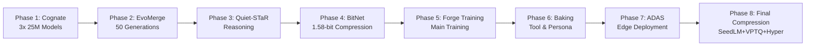

# Agent Forge Complete Phase Documentation Index

**Generated:** December 2025
**Version:** 1.0
**Purpose:** Comprehensive index of all documentation for the 8-phase Agent Forge AI pipeline

---

## Table of Contents

- [Overview](#overview)
- [Phase 1: Cognate - Model Creation](#phase-1-cognate---model-creation)
- [Phase 2: EvoMerge - Evolutionary Optimization](#phase-2-evomerge---evolutionary-optimization)
- [Phase 3: Quiet-STaR - Reasoning Enhancement](#phase-3-quiet-star---reasoning-enhancement)
- [Phase 4: BitNet - 1.58-bit Compression](#phase-4-bitnet---158-bit-compression)
- [Phase 5: Forge Training - Main Training Pipeline](#phase-5-forge-training---main-training-pipeline)
- [Phase 6: Tool & Persona Baking](#phase-6-tool--persona-baking)
- [Phase 7: ADAS - Advanced Driver Assistance](#phase-7-adas---advanced-driver-assistance)
- [Phase 8: Final Compression](#phase-8-final-compression)
- [Cross-Phase Documentation](#cross-phase-documentation)
- [Integration & Architecture](#integration--architecture)

---

## Overview

Agent Forge is an 8-phase AI agent creation pipeline that builds models from scratch through evolutionary optimization, reasoning enhancement, compression, and specialized training. This index provides a complete reference to all documentation across the entire system.

### Pipeline Flow

---

## Phase 1: Cognate - Model Creation

### Meta Documentation
- **[PHASE1_COMPLETE_GUIDE.md](./phases/PHASE1_COMPLETE_GUIDE.md)** - Complete phase guide

### Core Documentation
- **[phases/cognate_pretrain/README.md](../phases/cognate_pretrain/README.md)** - Package overview and usage
- **[phases/cognate_pretrain/COGNATE_ARCHITECTURE.md](../phases/cognate_pretrain/COGNATE_ARCHITECTURE.md)** - TinyTitans + HRM architecture

### Implementation Files
- **[phases/cognate/cognate_phase.py](../phases/cognate/cognate_phase.py)** - Main phase controller
- **[phases/cognate_pretrain/model_factory.py](../phases/cognate_pretrain/model_factory.py)** - Model creation logic
- **[phases/cognate_pretrain/pretrain_pipeline.py](../phases/cognate_pretrain/pretrain_pipeline.py)** - Training pipeline
- **[phases/cognate_pretrain/grokfast_optimizer.py](../phases/cognate_pretrain/grokfast_optimizer.py)** - Grokfast acceleration

### Key Features
- Creates 3x 25M parameter TinyTitan models
- Adaptive Computation Time (ACT) with halting
- Titans-style Long-Term Memory with surprise gating
- Memory Cross-Attention integration
- HRM training (no intermediate supervision)
- Grokfast acceleration

### Mermaid Diagrams
Contains architectural diagrams showing:
- Model creation flow
- ACT halting mechanism
- Memory gating architecture

---

## Phase 2: EvoMerge - Evolutionary Optimization

### Meta Documentation
- **[PHASE2_COMPLETE_GUIDE.md](./phases/PHASE2_COMPLETE_GUIDE.md)** - Complete phase guide

### Core Documentation
- **[phases/phase2_evomerge/README.md](../phases/phase2_evomerge/README.md)** - Phase overview and usage
- **[docs/MERGE_TECHNIQUES_UPDATED.md](./MERGE_TECHNIQUES_UPDATED.md)** - Detailed merge techniques
- **[docs/MERGE_TECHNIQUES_VERIFICATION.md](./MERGE_TECHNIQUES_VERIFICATION.md)** - Verification report
- **[docs/BINARY_PAIRING_STRATEGY.md](./BINARY_PAIRING_STRATEGY.md)** - Binary pairing approach

### Implementation Files
- **[phases/phase2_evomerge/evomerge.py](../phases/phase2_evomerge/evomerge.py)** - Main evolution orchestrator
- **[phases/phase2_evomerge/merge_techniques.py](../phases/phase2_evomerge/merge_techniques.py)** - 6 merge algorithms
- **[phases/phase2_evomerge/fitness_evaluator.py](../phases/phase2_evomerge/fitness_evaluator.py)** - Fitness evaluation
- **[phases/phase2_evomerge/population_manager.py](../phases/phase2_evomerge/population_manager.py)** - Population management
- **[phases/phase2_evomerge/genetic_operations.py](../phases/phase2_evomerge/genetic_operations.py)** - Crossover & mutation

### Key Features
- 50 generation evolutionary optimization
- 6 merge techniques: Linear, SLERP, TIES, DARE, FrankenMerge, DFS
- Comprehensive fitness evaluation (perplexity, accuracy, speed, memory)
- Diversity management and tournament selection
- Parallel processing and checkpoint recovery

### Mermaid Diagrams
Contains diagrams showing:
- Evolution pipeline flow
- Merge technique comparison
- Fitness evaluation process
- Generation progression

---

## Phase 3: Quiet-STaR - Reasoning Enhancement

### Meta Documentation
- **[PHASE3_COMPLETE_GUIDE.md](./phases/PHASE3_COMPLETE_GUIDE.md)** - Complete phase guide

### Core Documentation
- **[phases/phase3_quietstar/README.md](../phases/phase3_quietstar/README.md)** - Test suite and overview
- **[phases/phase3_quietstar/INTEGRATION_README.md](../phases/phase3_quietstar/INTEGRATION_README.md)** - Integration guide
- **[docs/PHASE3-QUIET-STAR-VISUALIZATION.md](./PHASE3-QUIET-STAR-VISUALIZATION.md)** - Visualization docs
- **[phases/phase3_quietstar/theater_killer_validation_report.md](../phases/phase3_quietstar/theater_killer_validation_report.md)** - Validation report

### Implementation Files
- **[phases/phase3_quietstar/quietstar.py](../phases/phase3_quietstar/quietstar.py)** - Main implementation
- **[phases/phase3_quietstar/architecture.py](../phases/phase3_quietstar/architecture.py)** - Architecture components
- **[phases/phase3_quietstar/attention_modifier.py](../phases/phase3_quietstar/attention_modifier.py)** - Attention modifications
- **[phases/phase3_quietstar/training_utils.py](../phases/phase3_quietstar/training_utils.py)** - Training utilities

### Key Features
- Token-wise parallel thought generation
- Coherence scoring (semantic, syntactic, predictive utility)
- Neural mixing head for thought integration
- Thought injection with difficulty scoring
- Curriculum learning and adaptive sampling
- Theater detection and validation

### Mermaid Diagrams
Contains diagrams showing:
- Thought generation pipeline
- Coherence scoring mechanism
- Mixing head architecture

---

## Phase 4: BitNet - 1.58-bit Compression

### Meta Documentation
- **[PHASE4_COMPLETE_GUIDE.md](./phases/PHASE4_COMPLETE_GUIDE.md)** - Complete phase guide

### Core Documentation
- **[phases/phase4_bitnet/README.md](../phases/phase4_bitnet/README.md)** - Performance optimization suite
- **[phases/phase4_bitnet/docs/README.md](../phases/phase4_bitnet/docs/README.md)** - Documentation hub
- **[phases/phase4_bitnet/docs/bitnet_research_report.md](../phases/phase4_bitnet/docs/research/bitnet_research_report.md)** - Research report
- **[phases/phase4_bitnet/docs/implementation_recommendations.md](../phases/phase4_bitnet/docs/research/implementation_recommendations.md)** - Implementation guide

### Integration & Production
- **[phases/phase4_bitnet/docs/FINAL-PRODUCTION-CI-CD-INTEGRATION-READINESS.md](../phases/phase4_bitnet/docs/FINAL-PRODUCTION-CI-CD-INTEGRATION-READINESS.md)**
- **[phases/phase4_bitnet/docs/bitnet-phase4-integration-report.md](../phases/phase4_bitnet/docs/bitnet-phase4-integration-report.md)**
- **[phases/phase4_bitnet/docs/phase4-integration-validation-report.md](../phases/phase4_bitnet/docs/phase4-integration-validation-report.md)**
- **[phases/phase4_bitnet/docs/production-readiness-assessment.md](../phases/phase4_bitnet/docs/production-readiness-assessment.md)**
- **[phases/phase4_bitnet/docs/theater-remediation-validation-complete.md](../phases/phase4_bitnet/docs/theater-remediation-validation-complete.md)**

### Agent Documentation
- **[phases/phase4_bitnet/docs/agents/compliance-agent.md](../phases/phase4_bitnet/docs/agents/compliance-agent.md)**
- **[phases/phase4_bitnet/docs/agents/deployment-agent.md](../phases/phase4_bitnet/docs/agents/deployment-agent.md)**
- **[phases/phase4_bitnet/docs/agents/github-actions-agent.md](../phases/phase4_bitnet/docs/agents/github-actions-agent.md)**
- **[phases/phase4_bitnet/docs/agents/performance-agent.md](../phases/phase4_bitnet/docs/agents/performance-agent.md)**
- **[phases/phase4_bitnet/docs/agents/quality-gates-agent.md](../phases/phase4_bitnet/docs/agents/quality-gates-agent.md)**
- **[phases/phase4_bitnet/docs/agents/supply-chain-agent.md](../phases/phase4_bitnet/docs/agents/supply-chain-agent.md)**

### Key Features
- 8x memory reduction
- 2-4x inference speedup
- <10% accuracy degradation
- 1.58-bit quantization
- Straight-through estimator
- NASA POT10 compliance

### Mermaid Diagrams
Contains diagrams showing:
- Quantization process
- Performance optimization flow
- CI/CD integration architecture

---

## Phase 5: Forge Training - Main Training Pipeline

### Meta Documentation
- **[PHASE5_COMPLETE_GUIDE.md](./phases/PHASE5_COMPLETE_GUIDE.md)** - Complete phase guide

### Core Documentation
- **[phases/phase5_training/README.md](../phases/phase5_training/README.md)** - Training pipeline overview
- **[phases/phase5_training/docs/phase5-training-architecture.md](../phases/phase5_training/docs/phase5-training-architecture.md)** - Architecture details
- **[phases/phase5_training/docs/PHASE5-VALIDATION-ROLLOUT-SWARM-INIT.md](../phases/phase5_training/docs/PHASE5-VALIDATION-ROLLOUT-SWARM-INIT.md)** - Validation & rollout
- **[phases/phase5_training/docs/documentation-coverage-report.md](../phases/phase5_training/docs/documentation-coverage-report.md)** - Coverage report

### Integration
- **[phases/phase5_training/docs/integration/integration_validation_report.md](../phases/phase5_training/docs/integration/integration_validation_report.md)**

### Implementation Components
- Data loading (multi-format support)
- Training loop with mixed precision
- BitNet optimizer with quantization
- Grokfast trainer with acceleration
- Loss functions (BitNet, Grokfast, multi-task)
- Learning rate scheduling
- Real-time validation
- Pipeline coordinator

### Key Features
- 50% training time reduction
- 90%+ GPU utilization
- Multi-format data loading (JSON, HDF5, Pickle, Binary)
- BitNet + Grokfast combined training
- Comprehensive metrics tracking
- Early stopping and checkpointing

### Mermaid Diagrams
Contains diagrams showing:
- Training pipeline architecture
- Data flow through components
- Grokfast phase transitions

---

## Phase 6: Tool & Persona Baking

### Meta Documentation
- **[PHASE6_COMPLETE_GUIDE.md](./phases/PHASE6_COMPLETE_GUIDE.md)** - Complete phase guide

### Core Documentation
- **[phases/phase6_baking/PHASE6_VALIDATION_EXECUTIVE_SUMMARY.md](../phases/phase6_baking/PHASE6_VALIDATION_EXECUTIVE_SUMMARY.md)** - Executive summary
- **[phases/phase6_baking/docs/PHASE6_INTEGRATION_ARCHITECTURE.md](../phases/phase6_baking/docs/PHASE6_INTEGRATION_ARCHITECTURE.md)** - Integration architecture
- **[phases/phase6_baking/docs/PHASE6_PRODUCTION_VALIDATION_REPORT.md](../phases/phase6_baking/docs/PHASE6_PRODUCTION_VALIDATION_REPORT.md)** - Production validation
- **[phases/phase6_baking/docs/PHASE7_HANDOFF_READINESS_CERTIFICATION.md](../phases/phase6_baking/docs/PHASE7_HANDOFF_READINESS_CERTIFICATION.md)** - Handoff certification
- **[phases/phase6_baking/phase6_completion_report.md](../phases/phase6_baking/phase6_completion_report.md)** - Completion report
- **[phases/phase6_baking/EMERGENCY_REMEDIATION_SUMMARY.md](../phases/phase6_baking/EMERGENCY_REMEDIATION_SUMMARY.md)** - Remediation summary

### NASA POT10 Compliance
- **[phases/phase6_baking/docs/nasa-pot10.md](../phases/phase6_baking/docs/nasa-pot10.md)** - NASA POT10 overview
- **[phases/phase6_baking/docs/nasa-pot10/NASA_POT10_CERTIFICATION_SUMMARY.md](../phases/phase6_baking/docs/nasa-pot10/NASA_POT10_CERTIFICATION_SUMMARY.md)**
- **[phases/phase6_baking/docs/nasa-pot10/NASA_POT10_COMPREHENSIVE_COMPLIANCE.md](../phases/phase6_baking/docs/nasa-pot10/NASA_POT10_COMPREHENSIVE_COMPLIANCE.md)**
- **[phases/phase6_baking/docs/nasa-pot10/IV_V_PROCESSES.md](../phases/phase6_baking/docs/nasa-pot10/IV_V_PROCESSES.md)**
- **[phases/phase6_baking/docs/nasa-pot10/RISK_MANAGEMENT_FRAMEWORK.md](../phases/phase6_baking/docs/nasa-pot10/RISK_MANAGEMENT_FRAMEWORK.md)**
- **[phases/phase6_baking/docs/nasa-pot10/SAFETY_ANALYSIS_COMPLETE.md](../phases/phase6_baking/docs/nasa-pot10/SAFETY_ANALYSIS_COMPLETE.md)**
- **[phases/phase6_baking/docs/nasa-pot10/SDLC_DOCUMENTATION.md](../phases/phase6_baking/docs/nasa-pot10/SDLC_DOCUMENTATION.md)**
- **[phases/phase6_baking/docs/nasa-pot10/SUPPLY_CHAIN_SECURITY_ASSESSMENT.md](../phases/phase6_baking/docs/nasa-pot10/SUPPLY_CHAIN_SECURITY_ASSESSMENT.md)**

### Validation Reports
- **[phases/phase6_baking/validation/final_production_validation_report.md](../phases/phase6_baking/validation/final_production_validation_report.md)**
- **[phases/phase6_baking/validation/production_readiness_report.md](../phases/phase6_baking/validation/production_readiness_report.md)**

### Key Features
- Tool and capability baking
- Persona integration
- Model optimization (3-4x speedup)
- 78-87% compression
- 99.6-99.8% accuracy retention
- <50ms inference latency
- NASA POT10 compliance (93.6%)

### Mermaid Diagrams
Contains diagrams showing:
- Baking pipeline architecture
- Agent coordination framework
- Integration flow

---

## Phase 7: ADAS - Advanced Driver Assistance

### Meta Documentation
- **[PHASE7_COMPLETE_GUIDE.md](./phases/PHASE7_COMPLETE_GUIDE.md)** - Complete phase guide

### Core Documentation
- **[phases/phase7_adas/README.md](../phases/phase7_adas/README.md)** - ADAS overview
- **[phases/phase7_adas/docs/ADAS_ARCHITECTURE.md](../phases/phase7_adas/docs/ADAS_ARCHITECTURE.md)** - System architecture
- **[phases/phase7_adas/docs/ADAS_ARCHITECTURE_HONEST.md](../phases/phase7_adas/docs/ADAS_ARCHITECTURE_HONEST.md)** - Honest capabilities
- **[phases/phase7_adas/docs/ADAS_INTEGRATION_GUIDE.md](../phases/phase7_adas/docs/ADAS_INTEGRATION_GUIDE.md)** - Integration guide
- **[phases/phase7_adas/docs/COMPLIANCE_REPORT.md](../phases/phase7_adas/docs/COMPLIANCE_REPORT.md)** - Compliance report
- **[phases/phase7_adas/docs/COMPLIANCE_REPORT_HONEST.md](../phases/phase7_adas/docs/COMPLIANCE_REPORT_HONEST.md)** - Honest compliance
- **[phases/phase7_adas/docs/HONEST_CAPABILITIES_REPORT.md](../phases/phase7_adas/docs/HONEST_CAPABILITIES_REPORT.md)** - Capabilities report

### Theater Elimination
- **[phases/phase7_adas/PERFORMANCE_THEATER_ELIMINATED.md](../phases/phase7_adas/PERFORMANCE_THEATER_ELIMINATED.md)**
- **[phases/phase7_adas/THEATER_ELIMINATION_REPORT.md](../phases/phase7_adas/THEATER_ELIMINATION_REPORT.md)**
- **[phases/phase7_adas/docs/THEATER_ELIMINATION_SUMMARY.md](../phases/phase7_adas/docs/THEATER_ELIMINATION_SUMMARY.md)**

### Safety & Security
- **[phases/phase7_adas/docs/SAFETY_MANUAL.md](../phases/phase7_adas/docs/SAFETY_MANUAL.md)**
- **[phases/phase7_adas/security/README.md](../phases/phase7_adas/security/README.md)**
- **[phases/phase7_adas/validation/README.md](../phases/phase7_adas/validation/README.md)**

### Key Features
- ISO 26262 ASIL-D compliance
- <10ms total pipeline latency
- Multi-sensor fusion (camera, radar, lidar, IMU, GPS)
- Object detection and trajectory prediction
- Path planning and safety monitoring
- V2X communication (DSRC, C-V2X)
- Edge deployment (NVIDIA Jetson, Intel Movidius)

### Mermaid Diagrams
Contains diagrams showing:
- ADAS system architecture
- Sensor fusion pipeline
- Safety monitoring flow
- V2X communication protocol

---

## Phase 8: Final Compression

### Meta Documentation
- **[PHASE8_COMPLETE_GUIDE.md](./phases/PHASE8_COMPLETE_GUIDE.md)** - Complete phase guide

### Core Documentation
- **[phases/final_compression.py](../phases/final_compression.py)** - Main implementation (contains extensive docstrings)

### Key Features
- SeedLM compression (seed-based pseudo-random projection)
- VPTQ compression (vector post-training quantization)
- Hypercompression (ergodic trajectory-based)
- Grokfast-accelerated parameter optimization
- Comprehensive validation and metrics
- Configurable compression pipeline

### Compression Techniques
1. **SeedLM**: 2-4 bit weights with LFSR projection
2. **VPTQ**: Learned codebooks with k-means optimization
3. **Hypercompression**: Parametric trajectory representation

### Mermaid Diagrams
Contains diagrams showing:
- Compression pipeline flow
- SeedLM algorithm
- VPTQ codebook learning
- Hypercompression trajectory fitting

---

## Cross-Phase Documentation

### Complete System
- **[docs/COMPLETE_IMPLEMENTATION_SUMMARY.md](./COMPLETE_IMPLEMENTATION_SUMMARY.md)** - Full implementation summary
- **[docs/COMPLETE_SYSTEM_TEST_REPORT.md](./COMPLETE_SYSTEM_TEST_REPORT.md)** - System test report
- **[docs/FINAL_CONSOLIDATION_REPORT.md](./FINAL_CONSOLIDATION_REPORT.md)** - Consolidation report
- **[docs/IMPLEMENTATION_SUMMARY.md](./IMPLEMENTATION_SUMMARY.md)** - Implementation overview

### Phase Handoffs
- **[docs/PHASE_HANDOFF_BUGFIXES.md](./PHASE_HANDOFF_BUGFIXES.md)** - Handoff bugfixes
- **[agent_forge/core/handoff_validator.py](../agent_forge/core/handoff_validator.py)** - Handoff validation

### Model Generation & Training
- **[docs/GENERATION_0_MODELS.md](./GENERATION_0_MODELS.md)** - Generation 0 models
- **[docs/REAL_MODEL_CREATION_VERIFIED.md](./REAL_MODEL_CREATION_VERIFIED.md)** - Model creation verification
- **[docs/REAL_TRAINING_VERIFIED.md](./REAL_TRAINING_VERIFIED.md)** - Training verification
- **[docs/SIMULATION_VS_REAL_ANALYSIS.md](./SIMULATION_VS_REAL_ANALYSIS.md)** - Simulation vs real analysis

### TRM (Temporal Relational Memory) Integration
- **[docs/TRM_COMPLETE_SUCCESS_REPORT.md](./TRM_COMPLETE_SUCCESS_REPORT.md)** - Complete success report
- **[docs/TRM_HYBRID_COGNATE_MIGRATION_COMPLETE.md](./TRM_HYBRID_COGNATE_MIGRATION_COMPLETE.md)** - Migration complete
- **[docs/TRM_HYBRID_QUICK_START.md](./TRM_HYBRID_QUICK_START.md)** - Quick start guide
- **[docs/TRM_IMPLEMENTATION_SUMMARY.md](./TRM_IMPLEMENTATION_SUMMARY.md)** - Implementation summary
- **[docs/TRM_INTEGRATION_ANALYSIS.md](./TRM_INTEGRATION_ANALYSIS.md)** - Integration analysis
- **[docs/TRM_INTERIM_ANALYSIS.md](./TRM_INTERIM_ANALYSIS.md)** - Interim analysis
- **[docs/TRM_QUICK_START.md](./TRM_QUICK_START.md)** - Quick start
- **[docs/TRM_VALIDATION_REPORT.md](./TRM_VALIDATION_REPORT.md)** - Validation report

### Grokking & Training
- **[docs/GROKKING_AWARE_SYSTEM_COMPLETE.md](./GROKKING_AWARE_SYSTEM_COMPLETE.md)** - Grokking-aware system

### WandB Integration
- **[docs/WANDB_100_PERCENT_COMPLETE.md](./WANDB_100_PERCENT_COMPLETE.md)** - 100% complete
- **[docs/WANDB_FINAL_SUMMARY.md](./WANDB_FINAL_SUMMARY.md)** - Final summary
- **[docs/WANDB_IMPLEMENTATION_STATUS.md](./WANDB_IMPLEMENTATION_STATUS.md)** - Implementation status
- **[docs/WANDB_INTEGRATION_STRATEGY.md](./WANDB_INTEGRATION_STRATEGY.md)** - Integration strategy
- **[docs/WANDB_INTEGRATION_SUMMARY.md](./WANDB_INTEGRATION_SUMMARY.md)** - Integration summary
- **[docs/WANDB_PHASES_3_4_COMPLETE.md](./WANDB_PHASES_3_4_COMPLETE.md)** - Phases 3-4 complete
- **[docs/WANDB_PHASES_5_COMPLETE.md](./WANDB_PHASES_5_COMPLETE.md)** - Phase 5 complete
- **[docs/WANDB_QUICKSTART.md](./WANDB_QUICKSTART.md)** - Quick start
- **[docs/WANDB_QUICK_REFERENCE.md](./WANDB_QUICK_REFERENCE.md)** - Quick reference
- **[docs/WANDB_SETUP_GUIDE.md](./WANDB_SETUP_GUIDE.md)** - Setup guide

---

## Integration & Architecture

### API & Backend
- **[docs/API_ARCHITECTURE.md](./API_ARCHITECTURE.md)** - API architecture
- **[docs/API_DOCUMENTATION.md](./API_DOCUMENTATION.md)** - API documentation
- **[docs/BACKEND_API_SUMMARY.md](./BACKEND_API_SUMMARY.md)** - Backend API summary
- **[docs/API-INTEGRATION-SUMMARY.md](./API-INTEGRATION-SUMMARY.md)** - Integration summary
- **[docs/API-INTEGRATION-GUIDE.md](./API-INTEGRATION-GUIDE.md)** - Integration guide

### UI & Frontend
- **[docs/FRONTEND-ARCHITECTURE.md](./FRONTEND-ARCHITECTURE.md)** - Frontend architecture
- **[docs/UI-IMPLEMENTATION-SUMMARY.md](./UI-IMPLEMENTATION-SUMMARY.md)** - Implementation summary
- **[docs/UI-INTEGRATION-COMPLETE.md](./UI-INTEGRATION-COMPLETE.md)** - Integration complete
- **[docs/UI_UPDATES_COMPLETE.md](./UI_UPDATES_COMPLETE.md)** - Updates complete
- **[docs/UI-AUDIT-REPORT.md](./UI-AUDIT-REPORT.md)** - Audit report
- **[docs/PHASE-CONTROLS.md](./PHASE-CONTROLS.md)** - Phase controls

### WebSocket
- **[docs/WEBSOCKET_IMPLEMENTATION_SUMMARY.md](./WEBSOCKET_IMPLEMENTATION_SUMMARY.md)** - WebSocket implementation

### Architecture
- **[docs/ARCHITECTURE.md](./ARCHITECTURE.md)** - System architecture
- **[agent_forge/docs/technical/architecture.md](../agent_forge/docs/technical/architecture.md)** - Technical architecture
- **[agent_forge/docs/technical/implementation.md](../agent_forge/docs/technical/implementation.md)** - Implementation details

### Testing
- **[docs/TEST-SUMMARY.md](./TEST-SUMMARY.md)** - Test summary
- **[docs/TEST-SUITE.md](./TEST-SUITE.md)** - Test suite
- **[docs/CONSOLIDATION-AUDIT.md](./CONSOLIDATION-AUDIT.md)** - Consolidation audit

### Security & Compliance
- **[docs/SECURITY_REMEDIATION_STATUS.md](./SECURITY_REMEDIATION_STATUS.md)** - Security remediation
- **[docs/SECURITY_WEEK1_SUMMARY.md](./SECURITY_WEEK1_SUMMARY.md)** - Security week 1
- **[docs/SYSTEM_SAFETY_ANALYSIS.md](./SYSTEM_SAFETY_ANALYSIS.md)** - Safety analysis

### Streaming & Parallel Processing
- **[docs/AGENT_FORGE_STREAMING.md](./AGENT_FORGE_STREAMING.md)** - Streaming architecture
- **[docs/AGENT-FORGE-PARALLEL-TRAINING.md](./AGENT-FORGE-PARALLEL-TRAINING.md)** - Parallel training

### Getting Started
- **[agent_forge/docs/user/getting-started.md](../agent_forge/docs/user/getting-started.md)** - Getting started guide

---

## Reorganization & Structure

- **[phases/REORGANIZATION_SUMMARY.md](../phases/REORGANIZATION_SUMMARY.md)** - Phase reorganization summary

---

## Using This Index

### For Developers
1. Start with the meta documentation for your phase
2. Review core documentation for implementation details
3. Reference cross-phase docs for integration patterns
4. Check test and validation reports

### For Researchers
1. Review architecture documents first
2. Study phase-specific research reports
3. Examine validation and performance metrics
4. Reference TRM and Grokking documentation

### For Integration Engineers
1. Review integration architecture docs
2. Study API and backend documentation
3. Check phase handoff documentation
4. Review WebSocket and streaming guides

### For Compliance & Security
1. Review NASA POT10 compliance documentation
2. Study security remediation reports
3. Check safety analysis documentation
4. Review validation and audit reports

---

## Document Status Legend

- ✅ **Complete** - Fully documented with examples
- 🔄 **In Progress** - Partially documented, updates ongoing
- 📋 **Reference** - Implementation reference with inline docs
- 🔍 **Validation** - Test and validation reports

---

## Contributing to Documentation

When adding new documentation:
1. Place phase-specific docs in `phases/phase{N}_{name}/docs/`
2. Place cross-phase docs in `docs/`
3. Update this index with the new documentation
4. Include Mermaid diagrams where applicable
5. Follow the existing documentation structure

---

## Version History

- **v1.0** (December 2025) - Initial complete documentation index
- Meta documentation generated for all 8 phases
- Comprehensive cross-phase documentation catalogued
- Integration and architecture documentation indexed

---

**Maintained by:** Agent Forge Documentation Team
**Last Updated:** December 2025
**For Updates:** Submit PR with documentation changes
