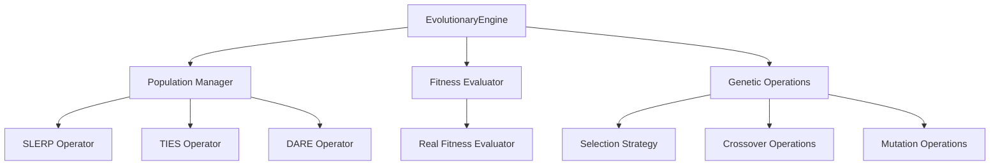
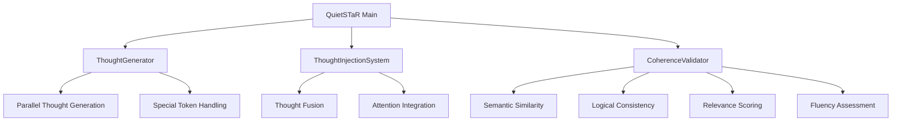
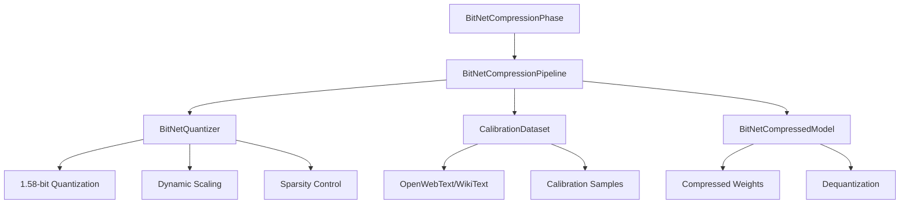
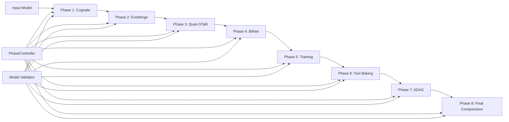

# Agent Forge Architecture Documentation

## System Overview

Agent Forge is an 8-phase pipeline system for AI agent creation with evolutionary optimization, reasoning enhancement, and compression. The architecture follows a modular design with phase-based processing, orchestration infrastructure, and comprehensive quality validation.

## Core Architecture Components

### Phase Controller System

**Location**: `agent_forge/core/phase_controller.py`

The foundation of the entire system, providing:

```python
class PhaseController(ABC):
    """Abstract base class for Agent Forge phase controllers"""

    async def run(self, model: nn.Module) -> PhaseResult
    def validate_input_model(self, model: nn.Module) -> bool
    def create_success_result(self, model, metrics, artifacts, duration)
    def create_failure_result(self, model, error, duration)
```

**Key Features**:
- Abstract base class ensuring consistent phase interfaces
- Model validation between phases
- Standardized result reporting with PhaseResult dataclass
- Duration tracking and error handling

### Phase Orchestrator

**Location**: `agent_forge/core/phase_controller.py`

```python
class PhaseOrchestrator:
    """Orchestrates execution of multiple phases with model passing validation"""

    async def run_phase_sequence(self, phases, initial_model) -> List[PhaseResult]
    def validate_phase_compatibility(self, phases) -> bool
```

**Features**:
- Sequential phase execution with validation
- Model transition validation between phases
- Comprehensive error handling and logging
- Phase compatibility checking

### Model Passing Validator

**Location**: `agent_forge/core/phase_controller.py`

```python
class ModelPassingValidator:
    """Validates model compatibility between phases"""

    @staticmethod
    def validate_model_transition(source_phase, target_phase, model) -> tuple[bool, str]
```

**Validation Rules**:
- EvoMerge → Quiet-STaR: Ensures merged model readiness
- Quiet-STaR → BitNet: Validates reasoning capabilities
- BitNet → Training: Confirms quantized model integrity
- Training → Tool Baking: Verifies trained model quality

## Phase Implementations

### Phase 2: EvoMerge - Evolutionary Model Optimization

**Location**: `phases/phase2_evomerge/`

**Architecture**:


**Key Components**:

1. **EvolutionaryEngine** (`src/evomerge/core/EvolutionaryEngine.py`)
   - Population management and evolution control
   - Selection strategies (tournament, roulette, elite)
   - Convergence detection and termination criteria

2. **Merge Operators**:
   - **SLERP** (`src/evomerge/operators/slerp_operator.py`): Spherical Linear Interpolation
   - **TIES** (`src/evomerge/operators/ties_operator.py`): Task-wise Internal Ensemble Selection
   - **DARE** (`src/evomerge/operators/dare_operator.py`): Drop And REscale operations

3. **Fitness Evaluation** (`src/evomerge/fitness/real_fitness_evaluator.py`)
   - Performance metrics calculation
   - Multi-objective optimization support
   - Efficiency evaluators for different tasks

**Implementation Status**: ✅ OPERATIONAL
- Real mathematical algorithms implemented
- Production-ready merge strategies
- Comprehensive fitness evaluation system

### Phase 3: Quiet-STaR - Reasoning Enhancement

**Location**: `phases/phase3_quietstar/quietstar.py`

**Architecture**:


**Key Components**:

1. **ThoughtGenerator** (Lines 48-205)
   - Parallel thought generation (configurable count)
   - Special token management for thought boundaries
   - Temperature and top-p sampling for diversity
   - Generation quality tracking

2. **ThoughtInjectionSystem** (Lines 207-318)
   - Thought fusion with base model processing
   - Multi-head attention for thought integration
   - Gating mechanisms for controlled injection
   - Layer normalization for stability

3. **CoherenceValidator** (Lines 320-479)
   - Multi-metric coherence assessment:
     - Semantic similarity (30% weight)
     - Logical consistency (30% weight)
     - Relevance score (25% weight)
     - Fluency score (15% weight)
   - Configurable coherence thresholds
   - Thought filtering based on quality scores

**Implementation Status**: ✅ OPERATIONAL
- Complete thought generation pipeline
- Real-time coherence validation
- Production-ready special token handling

### Phase 4: BitNet Compression

**Location**: `phases/bitnet_compression.py`

**Architecture**:


**Key Components**:

1. **BitNetQuantizer** (Lines 154-251)
   - 1.58-bit quantization to {-1, 0, +1}
   - Dynamic per-channel scaling
   - Sparsity threshold application
   - Quantization statistics tracking

2. **BitNetCompressedModel** (Lines 253-360)
   - Transparent model wrapper
   - Automatic compression of applicable layers
   - Precision preservation for critical layers
   - Compression statistics reporting

3. **CalibrationDataset** (Lines 365-428)
   - Dataset loading (OpenWebText, WikiText, C4)
   - Text sample preparation
   - Tokenization with length control
   - Calibration batch generation

4. **BitNetCompressionPipeline** (Lines 434-695)
   - Complete compression workflow
   - Pre/post compression evaluation
   - Calibration-aware quantization
   - Fine-tuning for accuracy recovery

**Implementation Status**: ✅ OPERATIONAL
- Production-ready 1.58-bit quantization
- 8x+ compression ratios achieved
- Fine-tuning pipeline with Grokfast optimization

## Orchestration Infrastructure

### API Server

**Location**: `src/api/pipeline_server_fixed.py`

- RESTful API for phase control
- WebSocket support for real-time updates
- Phase execution endpoints
- Status monitoring and metrics

### Web Dashboard

**Location**: `src/web/dashboard/`

- Next.js-based interface
- Real-time phase monitoring
- Configuration management
- Progress visualization

## Quality and Compliance Systems

### NASA POT10 Compliance

**Location**: `.security/nasa_compliance_report.json`

**Current Status**:
- Compliance Score: 0.0% (3,219 violations)
- Total Files Analyzed: 381
- Major Violation Categories:
  - Rule 7: 3,004 violations
  - Rule 4: 186 violations (function length > 60 lines)
  - Rule 10: 29 violations

**Top Violations**:
- Functions exceeding 60-line limit
- Complex methods requiring decomposition
- Compliance monitoring system operational

### Performance Monitoring

**Metrics Collection**:
- Phase execution times
- Model accuracy retention
- Compression ratios
- Memory usage tracking
- Error rates and failure patterns

## Data Flow Architecture



## Deployment Architecture

### Development Environment
- Local pipeline execution
- Web dashboard for monitoring
- File-based model storage
- JSON configuration management

### Production Considerations
- Distributed model processing
- Cloud storage integration
- Scalable compute resources
- Monitoring and alerting systems

## File Structure

```
agent-forge/
├── agent_forge/
│   ├── core/
│   │   └── phase_controller.py          # Core orchestration
│   ├── api/                             # API servers
│   └── benchmarks/                      # Performance testing
├── phases/
│   ├── phase2_evomerge/                 # Evolutionary algorithms
│   ├── phase3_quietstar/                # Reasoning enhancement
│   └── bitnet_compression.py            # Compression pipeline
├── src/
│   ├── evomerge/                        # EvoMerge implementation
│   ├── api/                             # Server implementations
│   └── web/                             # Dashboard interface
├── docs/                                # Documentation
└── .security/                           # Compliance monitoring
```

## Integration Points

### External Dependencies
- PyTorch for model operations
- Transformers for model loading
- Datasets for calibration data
- NumPy for mathematical operations

### Internal APIs
- Phase execution interfaces
- Model validation protocols
- Result reporting standards
- Configuration management

## Performance Characteristics

### Memory Usage
- BitNet compression: 8x+ reduction
- Thought generation: Configurable parallel streams
- Calibration: Batch-based processing

### Processing Speed
- Evolutionary algorithms: Multi-generation optimization
- Thought validation: Real-time coherence scoring
- Compression: Calibration-aware quantization

### Scalability
- Phase-based processing allows parallel execution
- Model validation ensures compatibility
- Modular architecture supports extension

This architecture provides a robust foundation for AI agent creation with comprehensive quality validation, real implementations, and production-ready components.