# Agent Forge V2: Complete Technical Specification

**Version**: 2.0.0
**Status**: Draft for Review
**Date**: 2025-10-15
**Target Audience**: Implementation Team, Stakeholders, Architects

---

## Document Control

| Version | Date | Author | Changes |
|---------|------|--------|---------|
| 2.0.0 | 2025-10-15 | Agent Forge Team | Initial V2 specification |

---

## Table of Contents

1. [Executive Summary](#1-executive-summary)
2. [8-Phase Pipeline Specification](#2-8-phase-pipeline-specification)
3. [Backend Infrastructure](#3-backend-infrastructure)
4. [Metrics & Tracking System](#4-metrics--tracking-system)
5. [UI & Visualization](#5-ui--visualization)
6. [API Specification](#6-api-specification)
7. [Quality & Compliance](#7-quality--compliance)
8. [Deployment & Operations](#8-deployment--operations)
9. [Data Schemas & Contracts](#9-data-schemas--contracts)
10. [Implementation Roadmap](#10-implementation-roadmap)

---

# 1. Executive Summary

## 1.1 Project Overview

**Agent Forge V2** is a ground-up rebuild of an 8-phase AI model creation pipeline designed to run **entirely locally** on consumer hardware. This specification defines the complete system architecture, infrastructure, and implementation requirements for building a production-ready local AI model pipeline.

### Mission Statement
Build small, efficient AI models (25M parameters) that can be created, trained, optimized, and deployed entirely on consumer hardware without cloud dependencies.

### Key Differentiators from V1
| Aspect | V1 (Reference) | V2 (This Build) |
|--------|----------------|-----------------|
| **Architecture** | Server-based (FastAPI, WebSocket, Next.js) | **Local-first** (CLI, Jupyter, local dashboard) |
| **Deployment** | Cloud infrastructure (S3, remote GPU, SQLite) | **Consumer hardware** (local GPU, local storage) |
| **Model Size** | Unspecified (implied large) | **25M parameters** (Phase 1), fits in 6GB VRAM |
| **Code Quality** | 1,416 files, 201 backups, 8 God objects | **Clean build**, NASA POT10 from day 1 |
| **Budget** | $250K+ for team + cloud | **$0** (local hardware, open-source) |
| **Timeline** | 26 weeks (refactoring plan) | **16 weeks** (clean build) |

## 1.2 System Architecture Vision

```mermaid
graph TB
    subgraph "User Interface Layer"
        CLI[CLI Interface]
        DASH[Local Dashboard]
        JUPYTER[Jupyter Notebooks]
    end

    subgraph "Orchestration Layer"
        ORCH[Pipeline Orchestrator]
        PHASE[Phase Controllers]
        STATE[State Manager]
    end

    subgraph "8-Phase Pipeline"
        P1[Phase 1: Cognate<br/>25M×3 Models]
        P2[Phase 2: EvoMerge<br/>50 Generations]
        P3[Phase 3: Quiet-STaR<br/>Reasoning]
        P4[Phase 4: BitNet<br/>8× Compression]
        P5[Phase 5: Forge<br/>Training]
        P6[Phase 6: Baking<br/>Tools/Persona]
        P7[Phase 7: Edge<br/>Deployment]
        P8[Phase 8: Final<br/>280× Compression]
    end

    subgraph "Infrastructure Layer"
        STORAGE[Model Storage<br/>Local Filesystem]
        REGISTRY[Model Registry<br/>SQLite/JSON]
        COMPUTE[Compute Manager<br/>GPU/CPU]
        MEMORY[Memory Manager<br/>RAM/VRAM]
    end

    subgraph "Monitoring Layer"
        WANDB[W&B Tracking<br/>650+ Metrics]
        METRICS[Performance Monitor]
        LOGS[Structured Logging]
    end

    CLI --> ORCH
    DASH --> ORCH
    JUPYTER --> ORCH

    ORCH --> PHASE
    PHASE --> P1 --> P2 --> P3 --> P4 --> P5 --> P6 --> P7 --> P8

    PHASE --> STATE
    P1 --> STORAGE
    P2 --> STORAGE
    P3 --> STORAGE
    P4 --> STORAGE
    P5 --> STORAGE
    P6 --> STORAGE
    P7 --> STORAGE
    P8 --> STORAGE

    STORAGE --> REGISTRY
    PHASE --> COMPUTE
    COMPUTE --> MEMORY

    PHASE --> WANDB
    PHASE --> METRICS
    PHASE --> LOGS
```



## 1.3 Success Criteria

### Technical Success Metrics
- ✅ **All 8 phases functional** and tested end-to-end
- ✅ **Phase 1 models**: 25M params, fit in 6GB VRAM, inference <100ms
- ✅ **100% NASA POT10 compliance**: All functions ≤60 LOC
- ✅ **≥90% test coverage**: ≥95% for critical paths
- ✅ **Local execution**: Entire pipeline runs on GTX 1660+ (6GB VRAM), 16GB RAM
- ✅ **Performance**: ≤5% degradation from research paper benchmarks
- ✅ **W&B integration**: 650+ metrics tracked across all phases

### Business Success Metrics
- ✅ **Timeline**: 16 weeks from start to production-ready
- ✅ **Budget**: $0 (assumes local hardware, open-source tools)
- ✅ **Reproducibility**: One-command setup, deterministic results
- ✅ **Documentation**: Complete specs, API docs, user guides
- ✅ **Community**: Open-source ready, contribution guidelines

## 1.4 Technology Stack

### Core ML/AI
- **Python 3.10+**: Primary language
- **PyTorch 2.0+**: Model framework
- **HuggingFace Transformers**: Model utilities, tokenization
- **NumPy/SciPy**: Mathematical operations

### Infrastructure
- **SQLite**: Model registry, metadata storage
- **YAML/JSON**: Configuration management
- **Local Filesystem**: Model storage, checkpoints

### Monitoring & Tracking
- **Weights & Biases (local)**: Experiment tracking (offline mode)
- **psutil**: System resource monitoring
- **structlog**: Structured logging

### UI & Visualization
- **Streamlit** (preferred): Local web dashboard
- **Rich**: CLI progress bars, tables, formatting
- **Plotly**: Interactive charts
- **Jupyter**: Notebook interface (optional)

### Development Tools
- **pytest**: Testing framework
- **black**: Code formatting
- **mypy**: Type checking
- **pre-commit**: Git hooks (NASA POT10 enforcement)

### NOT Used in V2 (V1 only)
- ~~FastAPI~~ (V1 server)
- ~~WebSocket~~ (V1 real-time)
- ~~Next.js~~ (V1 frontend)
- ~~S3~~ (V1 cloud storage)
- ~~Remote GPU~~ (V1 deployment)

## 1.5 Hardware Requirements

### Minimum Specifications
- **GPU**: CUDA-capable, GTX 1660 or equivalent (6GB+ VRAM)
- **RAM**: 16GB system memory
- **Storage**: 50GB available disk space
- **OS**: Windows 10+, Linux (Ubuntu 20.04+), macOS 11+
- **CPU**: Modern multi-core (4+ cores recommended)

### Recommended Specifications
- **GPU**: RTX 3060 or better (12GB+ VRAM)
- **RAM**: 32GB system memory
- **Storage**: 100GB SSD
- **CPU**: 8+ cores

### Performance Expectations
| Hardware Tier | Phase 1 Time | Full Pipeline | GPU Utilization |
|---------------|--------------|---------------|-----------------|
| **Minimum** (GTX 1660, 6GB) | 45 min | ~8 hours | 90-95% |
| **Recommended** (RTX 3060, 12GB) | 20 min | ~4 hours | 85-90% |
| **High-End** (RTX 4090, 24GB) | 10 min | ~2 hours | 75-85% |

## 1.6 Project Timeline

### 16-Week Build Plan


### Weekly Breakdown
- **Weeks 1-2**: Infrastructure + Phase 1 (Cognate)
- **Weeks 3-4**: Phase 2 (EvoMerge)
- **Weeks 5-6**: Phase 3 (Quiet-STaR) + W&B expansion
- **Weeks 7-8**: Phase 4 (BitNet) + Model management
- **Weeks 9-10**: Phase 5 (Forge) + Dashboard
- **Weeks 11-12**: Phases 6-8 implementation
- **Weeks 13-14**: Integration testing + UI polish
- **Weeks 15-16**: Documentation + Final validation

## 1.7 Resource Allocation

### Budget: $0 (Open-Source)
| Category | Cost | Notes |
|----------|------|-------|
| **Hardware** | $0 | Assumes user has consumer GPU |
| **Software** | $0 | PyTorch, HuggingFace, W&B free tier |
| **Cloud** | $0 | No cloud dependencies |
| **Labor** | $0 | Open-source contribution model |
| **TOTAL** | **$0** | Fully local, open-source |

### Team Composition
- **Core Contributors**: 1-2 developers (volunteer or sponsored)
- **Community Contributors**: Open for PRs and issues
- **Reviewers**: ML engineers with PyTorch experience

---

# 2. 8-Phase Pipeline Specification

This section provides detailed specifications for each of the 8 phases in the Agent Forge pipeline. Each phase builds upon the previous, transforming models from initial creation through final compression.

## 2.1 Phase 1: Cognate - Model Creation

### 2.1.1 Purpose & Overview
**Phase 1 (Cognate)** creates three specialized 25M parameter TinyTitan models that serve as the starting population for evolutionary optimization. It combines Titans-style neural memory with HRM training methodology.

### 2.1.2 Input Requirements
**Phase 1 has no input requirements** - it creates models from scratch.

### 2.1.3 Output Specification
```json
{
  "success": true,
  "model": "<pytorch.nn.Module>",
  "phase_name": "cognate",
  "metrics": {
    "num_models": 3,
    "total_parameters": 75208602,
    "parameters_per_model": 25069534,
    "total_size_mb": 286.5,
    "avg_size_mb": 95.5,
    "specializations": ["reasoning", "memory_integration", "adaptive_computation"],
    "training_epochs": 10,
    "final_loss_model_1": 2.54,
    "final_loss_model_2": 2.61,
    "final_loss_model_3": 2.48,
    "grokfast_enabled": true,
    "act_enabled": true,
    "titans_memory": true
  },
  "artifacts": {
    "all_models": ["<model1>", "<model2>", "<model3>"],
    "model_names": [
      "TinyTitan-reasoning",
      "TinyTitan-memory_integration",
      "TinyTitan-adaptive_computation"
    ],
    "model_ids": [
      "cognate_tinytitan_reasoning_20251015_143022",
      "cognate_tinytitan_memory_integration_20251015_143045",
      "cognate_tinytitan_adaptive_computation_20251015_143108"
    ],
    "seeds": [42, 1337, 2023]
  },
  "duration_seconds": 987.3
}
```

### 2.1.4 Architecture Specification

**⚠️ UPDATED ARCHITECTURE**: Phase 1 now uses **TRM × Titans-MAG** (Transformer Recursive Memory with Memory-Augmented Gating), not the outdated "TinyTitan" architecture.

For complete architecture details, see:
- **[phases/phase1/TRM_TITANS_ARCHITECTURE.md](../../phases/phase1/TRM_TITANS_ARCHITECTURE.md)** - Complete specification
- **[phases/phase1/PREMORTEM_CHECKLIST.md](../../phases/phase1/PREMORTEM_CHECKLIST.md)** - Failure modes and mitigations
- **[phases/phase1/configs/phase1_config.yaml](../../phases/phase1/configs/phase1_config.yaml)** - Configuration file
- **[phases/phase1/model/model_config.py](../../phases/phase1/model/model_config.py)** - Dataclass configurations

#### Architecture Summary

**TitansMAG Backbone** (8 layers, 512 dim, 25M params):
```yaml
model:
  d_model: 512               # Hidden dimension (NOT 768)
  n_layers: 8                # Transformer layers (NOT 12)
  n_heads: 8                 # Attention heads
  vocab_size: 32768          # BPE tokenizer
  max_seq_len: 2048

  attention:
    type: "sliding_window"
    sw_window: 1024          # ±512 tokens

  memory:
    type: "factorized"       # LMM (Long-range Memory Module)
    d_mem: 256               # Half of d_model
    decay: 0.99              # Exponential decay

gate:
  hidden: 256                # MAG gate network
  entropy_reg: 0.001         # Prevent saturation

trm:
  T_max: 3                   # Recursion depth (start)
  micro_steps: 2             # Refinement steps
  deep_supervision: true     # Loss per step
  detach_between_steps: true # Memory efficiency

act:
  halt_thresh: 0.5           # ACT halting threshold
  ema_teacher: 0.98          # EMA calibration
```

**Key Innovations**:
1. **TRM Wrapper**: Recursive refinement with g_φ (latent refine) and h_ψ (answer update)
2. **MAG Gate**: Convex blend between current output (y) and long-range memory (m)
3. **Sliding Window Attention**: O(n·w) complexity, enables 2048-token sequences
4. **Factorized LMM Memory**: 50% parameter reduction vs full memory
5. **Deep Supervision**: Loss computed at each recursion step
6. **ACT with EMA**: Prevents pathological halting (always step 0 or T_max)

### 2.1.5 Training Methodology

**⚠️ UPDATED**: Phase 1 now uses **TRM × Titans-MAG** with **MuonGrokfast** optimizer. See [TRM_TITANS_ARCHITECTURE.md](../../phases/phase1/TRM_TITANS_ARCHITECTURE.md) for complete training loop.

#### TRM Training Loop (Recursive Refinement)
```python
from cross_phase import MuonGrokfast, MuGrokConfig

# Phase 1 configuration
config = MuGrokConfig.from_phase(1)
optimizer = MuonGrokfast(model.parameters(), config=config)

for batch in dataloader:
    loss_total = 0
    z = z0_init(batch)  # Initial latent
    y = y0_init(batch)  # Initial answer

    for t in range(T_max):
        # Forward pass through TitansMAG backbone
        features = model.forward_once(batch.tokens)

        # TRM refinement
        z = trm.refine_latent(features, y, z, micro_steps=2)
        y = trm.update_answer(y, z)

        # Heads & losses
        logits = lm_head(y)
        q = act_head(z)
        step_loss = ce_loss(logits, labels) * step_weight(t)
        act_loss = act_bce_losses(q, logits, labels)
        loss_total += step_loss + act_loss

        # ACT early stop
        if should_halt(q):
            break

        # Detach for next iteration (memory efficiency)
        y = y.detach()
        z = z.detach()

    # Backward pass
    optimizer.zero_grad()
    loss_total.backward()
    optimizer.step()
```

#### MuonGrokfast Optimizer Configuration

**Phase 1 Preset** (from [cross-phase/mugrokfast_config.py](../../cross-phase/mugrokfast_config.py)):
```yaml
optim:
  kind: "muon_grokfast"

  # Grokfast (time-spectrum filtering)
  alpha: 0.98              # EMA decay
  lam: 0.3                 # Amplification (MORE aggressive than original 0.05)

  # Muon (space-geometry orthogonalization)
  k: 3                     # Newton-Schulz iterations (NOT 5)
  beta: 0.9                # Momentum
  weight_decay: 0.05       # Decoupled weight decay
  lr: 0.001                # Base learning rate

  # QK-Clip (attention stability)
  qkclip_tau: 30.0         # Threshold for Q/K norm
  qkclip_per_head: true    # Per-head scaling
  mlarope_protected: true  # Don't rescale rotary-K

  # Fallback (1-D params)
  fallback: "adamw"
  fallback_lr: 0.001
```

**Key Features** (see [Developer Guide #1](../../phases/phase1/TRM_TITANS_ARCHITECTURE.md)):
- **Grokfast Prefilter**: Dampens high-frequency noise, amplifies slow gradients
- **Muon Orthogonalization**: Prevents low-rank collapse, spreads updates across rare directions
- **Parameter Routing**: 2-D matrices → Muon path, 1-D params (bias, LayerNorm) → AdamW fallback
- **QK-Clip Safety**: Per-head attention logit bounding (respects MLA/RoPE)

**Training Flow**:
```
Input Batch
    ↓
TitansMAG Forward (SW-Attn, LMM memory, MAG gate)
    ↓
TRM Recursion (T_max=3 steps):
    ├─ g_φ Refine (micro_steps=2)
    ├─ h_ψ Update
    ├─ ACT Head (halt/continue)
    └─ Detach (if continue)
    ↓
Deep Supervision (loss per step)
    ↓
MuonGrokfast Optimizer Step:
    ├─ Grokfast Prefilter (λ=0.3)
    ├─ Parameter Routing
    ├─ Muon Orthogonalization (k=3)
    └─ QK-Clip Safety (τ=30.0)
```

**Expected Training Dynamics**:
- **Epochs 1-3**: TRM learns basic recursion (~2 steps avg)
- **Epochs 4-7**: ACT calibration stabilizes, gate balance emerges
- **Epochs 8-10**: Convergence, ACT avg_steps ~2-4, gate entropy ~0.6-0.8

### 2.1.6 Model Specializations

#### Model 1: Reasoning Focus
```python
config_model_1 = TinyTitanConfig(
    act_threshold=0.95,  # More computation steps
    memory_capacity=4096,
    surprise_weight=0.7,  # Prioritize surprise
    novelty_weight=0.3,
    seed=42
)
```
**Purpose**: Deep reasoning, complex problem-solving

#### Model 2: Memory Integration Focus
```python
config_model_2 = TinyTitanConfig(
    act_threshold=0.90,  # Balanced computation
    memory_capacity=8192,  # Larger memory
    surprise_weight=0.5,  # Balanced
    novelty_weight=0.5,
    seed=1337
)
```
**Purpose**: Long-context memory, information retrieval

#### Model 3: Adaptive Computation Focus
```python
config_model_3 = TinyTitanConfig(
    act_threshold=0.99,  # Minimal steps
    memory_capacity=2048,  # Smaller memory
    surprise_weight=0.3,
    novelty_weight=0.7,  # Prioritize novelty
    seed=2023
)
```
**Purpose**: Efficient inference, fast adaptation

### 2.1.7 Datasets
**Primary Datasets** (in order of preference):
1. **ARC-Easy** - Abstract reasoning challenges
2. **GSM8K** - Grade school math problems
3. **Mini-MBPP** - Python code generation
4. **PIQA** - Physical interaction QA
5. **SVAMP** - Math word problems

**Fallback**: Synthetic data generation if primary unavailable

### 2.1.8 Performance Targets
| Metric | Target | Validation |
|--------|--------|------------|
| **Parameters per model** | 25M ± 10% | `22.5M ≤ params ≤ 27.5M` |
| **Training time** | <30 min | GPU: GTX 1660, 6GB VRAM |
| **Memory usage** | <8GB | Peak VRAM + RAM combined |
| **Final loss** | <3.0 | Cross-entropy on validation set |
| **Inference latency** | <100ms | Batch size 1, sequence length 512 |

### 2.1.9 Success Criteria
- ✅ **3 models created** with distinct specializations
- ✅ **Parameter count** within 10% of 25M target
- ✅ **Training convergence**: Loss reduction >70% from initial
- ✅ **Model validation**: All models pass handoff validation
- ✅ **Storage**: Models saved with complete metadata
- ✅ **W&B logging**: 37 metrics tracked successfully

### 2.1.10 Error Handling
| Error Type | Recovery Strategy |
|------------|-------------------|
| **CUDA OOM** | Reduce batch size → Reduce model size → Fall back to CPU |
| **Training divergence** | Reload checkpoint → Reduce learning rate → Add gradient clipping |
| **Dataset unavailable** | Switch to fallback dataset → Generate synthetic data |
| **Disk full** | Clean old checkpoints → Compress models → Alert user |

### 2.1.11 W&B Metrics (37 total)
```python
# Per-model metrics (×3 models)
"model_{N}/size_mb": float
"model_{N}/parameters": int
"model_{N}/train/loss": float  # Per step
"model_{N}/train/loss_avg_100": float  # 100-step MA
"model_{N}/epoch/loss": float  # Per epoch

# Phase-level metrics
"phase/num_models_created": 3
"phase/total_parameters": int
"phase/avg_final_loss": float
"phase/duration_seconds": float
"phase/success": bool
```

---

## 2.2 Phase 2: EvoMerge - Evolutionary Optimization

### 2.2.1 Purpose & Overview
**Phase 2 (EvoMerge)** takes the 3 models from Phase 1 and evolves them over 50 generations using **8 binary merge combinations** (3-bit encoding) and an **elite mutation + loser merging** evolution strategy to produce a single optimized model.

**⚠️ UPDATED STRATEGY**: Phase 2 now uses binary combination strategy (000-111) with elite mutation (top 2 → 6 children) + loser merging (bottom 6 → 2 children).

For complete details, see:
- **[phases/phase2/LOGICAL_UNDERSTANDING.md](../../phases/phase2/LOGICAL_UNDERSTANDING.md)** - Conceptual overview
- **[phases/phase2/PHASE2_COMPLETE_GUIDE.md](../../phases/phase2/PHASE2_COMPLETE_GUIDE.md)** - Complete implementation guide

### 2.2.2 Input Requirements
```json
{
  "input_models": ["<model1>", "<model2>", "<model3>"],
  "model_metadata": [
    {"specialization": "reasoning", "final_loss": 2.54},
    {"specialization": "memory_integration", "final_loss": 2.61},
    {"specialization": "adaptive_computation", "final_loss": 2.48}
  ]
}
```

**Validation**:
- ✅ Exactly 3 models required
- ✅ All models same architecture (hidden_size, num_layers, vocab_size)
- ✅ All models have valid state_dicts
- ✅ Combined size <1GB

### 2.2.3 Output Specification
```json
{
  "success": true,
  "model": "<merged_model>",
  "phase_name": "evomerge",
  "metrics": {
    "initial_fitness": 0.45,
    "final_fitness": 0.89,
    "fitness_improvement": 0.44,
    "fitness_improvement_percent": 97.8,
    "generations_completed": 50,
    "best_merge_technique": "TIES",
    "compression_ratio": 3.0,
    "parameters_before": 75208602,
    "parameters_after": 25069534,
    "final_accuracy": 0.85,
    "final_perplexity": 18.2
  },
  "artifacts": {
    "model_id": "evomerge_gen50_best_20251015_150022",
    "merge_history": ["<gen0_best>", "...", "<gen50_best>"],
    "fitness_curve": [0.45, 0.48, 0.52, "...", 0.89],
    "best_merge_weights": {"SLERP": 0.3, "TIES": 0.5, "DARE": 0.2}
  },
  "duration_seconds": 9023.5
}
```

### 2.2.4 Binary Combination Strategy

**Phase 2 uses 8 binary combinations** (3-bit encoding: 000-111) where each bit selects one technique from a mutually exclusive pair. The 6 techniques are organized into **3 pairs**:

**Binary Encoding**:
- **Bit 0** (Interpolation): `0` = Linear, `1` = SLERP
- **Bit 1** (Task Arithmetic): `0` = DARE, `1` = TIES
- **Bit 2** (Selection): `0` = FrankenMerge, `1` = DFS

**Complete Implementation**: See [phases/phase2/PHASE2_COMPLETE_GUIDE.md](../../phases/phase2/PHASE2_COMPLETE_GUIDE.md) for detailed merge algorithms.

#### Binary Combination Application

```python
def apply_merge_combo(models: List[nn.Module], combo_id: int) -> nn.Module:
    """Apply 3-stage merge based on 3-bit combo ID (0-7)"""

    # Decode binary combination
    bit0 = (combo_id >> 0) & 1  # Interpolation
    bit1 = (combo_id >> 1) & 1  # Task arithmetic
    bit2 = (combo_id >> 2) & 1  # Selection

    # Stage 1: Interpolation (combines 3 models → 1)
    if bit0 == 0:
        # Linear: weighted average
        stage1 = linear_merge(models[0], models[1], models[2])
    else:
        # SLERP: spherical interpolation
        stage1 = slerp_merge(models[0], models[1], models[2])

    # Stage 2: Task Arithmetic (modifies merged model)
    if bit1 == 0:
        # DARE: drop 90%, rescale 10×
        stage2 = dare_merge(stage1, drop_rate=0.9)
    else:
        # TIES: trim 20%, elect sign, merge
        stage2 = ties_merge(stage1, trim_ratio=0.2)

    # Stage 3: Selection (final refinement)
    if bit2 == 0:
        # FrankenMerge: layer-wise selection
        stage3 = frankenmerge(stage2, models)
    else:
        # DFS: dynamic fusion
        stage3 = dfs_merge(stage2, models)

    return stage3
```

#### Merge Technique Details

**Pair 1 - Interpolation** (combines 3 models into 1):

1. **Linear (Bit 0 = 0)**: Simple weighted average
   ```python
   merged = 0.33*model1 + 0.33*model2 + 0.33*model3
   ```

2. **SLERP (Bit 0 = 1)**: Spherical linear interpolation (preserves magnitude)
   ```python
   # Pairwise SLERP: (m1 ⊕ m2) ⊕ m3
   temp = slerp(model1, model2, t=0.5)
   merged = slerp(temp, model3, t=0.5)
   ```

**Pair 2 - Task Arithmetic** (modifies merged model):

3. **DARE (Bit 1 = 0)**: Drop And REscale (sparse updates)
   ```python
   delta = merged - base_model
   mask = bernoulli(1 - 0.9)  # Keep 10%
   sparse_delta = delta * mask * 10  # Rescale 10×
   result = base_model + sparse_delta
   ```

4. **TIES (Bit 1 = 1)**: TrIm, Elect sign, merge
   ```python
   delta = merged - base_model
   trimmed = trim_top_k(delta, k=0.2)  # Keep top 20%
   sign = elect_sign(trimmed)  # Majority voting
   result = base_model + trimmed * sign
   ```

**Pair 3 - Selection** (final refinement):

5. **FrankenMerge (Bit 2 = 0)**: Layer-wise selection from best performers
   ```python
   # Select each layer from best-performing original model
   for layer_idx in range(num_layers):
       best_model = argmax(fitness(m) for m in models)
       result.layers[layer_idx] = best_model.layers[layer_idx]
   ```

6. **DFS (Bit 2 = 1)**: Dynamic Fusion Strategy (importance weighting)
   ```python
   # Weight each model by importance score
   importance = [compute_importance(m) for m in models]
   weights = softmax(importance)
   result = sum(w * m for w, m in zip(weights, models))
   ```

#### Binary Combination Table

| Combo | Binary | Stage 1 | Stage 2 | Stage 3 | Description |
|-------|--------|---------|---------|---------|-------------|
| 0 | 000 | Linear | DARE | FrankenMerge | Sparse + Layer selection |
| 1 | 001 | Linear | DARE | DFS | Sparse + Importance |
| 2 | 010 | Linear | TIES | FrankenMerge | Sign voting + Layer |
| 3 | 011 | Linear | TIES | DFS | Sign voting + Importance |
| 4 | 100 | SLERP | DARE | FrankenMerge | Geometric + Sparse + Layer |
| 5 | 101 | SLERP | DARE | DFS | Geometric + Sparse + Importance |
| 6 | 110 | SLERP | TIES | FrankenMerge | Geometric + Sign + Layer |
| 7 | 111 | SLERP | TIES | DFS | Geometric + Sign + Importance |

### 2.2.5 Elite Mutation + Loser Merging Evolution

**Phase 2 uses a hybrid evolution strategy**:
- **Elite Mutation**: Top 2 models → mutate 3× each → 6 elite children
- **Loser Merging**: Bottom 6 models → split into 2 groups of 3 → merge using random combo → 2 loser children
- **Population Size**: Fixed at 8 models per generation (memory efficient)

**Complete Implementation**: See [phases/phase2/PHASE2_COMPLETE_GUIDE.md](../../phases/phase2/PHASE2_COMPLETE_GUIDE.md) for full evolution loop.

#### Generation 0: Binary Combination Initialization

```python
def initialize_population(model1, model2, model3):
    """Create all 8 binary combinations from 3 Phase 1 models"""
    population = []
    champion = None
    best_fitness = -float('inf')

    for combo_id in range(8):  # 000 to 111
        # Apply binary combination
        merged = apply_merge_combo([model1, model2, model3], combo_id)

        # Evaluate fitness
        fitness = evaluate_composite_fitness(merged, val_dataset)

        population.append(merged)

        # Track champion
        if fitness > best_fitness:
            champion = merged
            best_fitness = fitness

    return population, champion
```

#### Composite Fitness Evaluation

```python
def evaluate_composite_fitness(model, val_dataset):
    """Multi-objective fitness with fixed weights"""

    # Component 1: Perplexity (40% weight)
    perplexity = evaluate_perplexity(model, val_dataset)
    perplexity_score = 1.0 / perplexity

    # Component 2: Accuracy (30% weight)
    accuracy = evaluate_accuracy(model, val_dataset)

    # Component 3: Speed (20% weight)
    tokens_per_sec = evaluate_speed(model, benchmark_batch)
    speed_score = tokens_per_sec / expected_throughput

    # Component 4: Memory (10% weight)
    peak_memory_mb = evaluate_memory(model)
    memory_score = 1.0 / (peak_memory_mb / expected_memory_mb)

    # Composite fitness (weighted sum)
    composite_fitness = (
        0.4 * perplexity_score +
        0.3 * accuracy +
        0.2 * speed_score +
        0.1 * memory_score
    )

    return composite_fitness
```

#### Elite Mutation (Top 2 → 6 Children)

```python
def elite_mutation(elite1, elite2):
    """Mutate top 2 models 3× each → 6 elite children"""
    elite_children = []

    for elite_model in [elite1, elite2]:
        for _ in range(3):
            # Gaussian noise mutation
            child = mutate(
                elite_model,
                sigma=0.01,       # Standard deviation
                rate=0.01         # Mutation rate (1% of params)
            )
            elite_children.append(child)

    return elite_children  # 6 children

def mutate(model, sigma=0.01, rate=0.01):
    """Add Gaussian noise to a fraction of parameters"""
    mutated_state = {}

    for key, param in model.state_dict().items():
        # Mutation mask (1% of parameters)
        mask = torch.bernoulli(torch.full_like(param, rate))

        # Gaussian noise
        noise = torch.randn_like(param) * sigma

        # Apply mutation
        mutated_state[key] = param + mask * noise

    return create_model(mutated_state)
```

#### Loser Merging (Bottom 6 → 2 Children)

```python
def loser_merging(bottom_6_models):
    """Split bottom 6 into 2 groups, merge each → 2 loser children"""

    # Split into 2 groups of 3
    group1 = bottom_6_models[0:3]
    group2 = bottom_6_models[3:6]

    # Random merge combo for each group
    combo1 = random.randint(0, 7)  # Random combo 000-111
    combo2 = random.randint(0, 7)

    # Merge each group
    loser_child1 = apply_merge_combo(group1, combo1)
    loser_child2 = apply_merge_combo(group2, combo2)

    return [loser_child1, loser_child2]  # 2 children
```

#### Complete Evolution Loop (Generations 1-50)

```python
def evolve(model1, model2, model3, num_generations=50):
    """Elite mutation + loser merging evolution"""

    # Generation 0: Initialize with 8 binary combinations
    population, champion = initialize_population(model1, model2, model3)

    for generation in range(1, num_generations + 1):
        # Step 1: Evaluate fitness for all 8 models
        fitness_scores = [
            evaluate_composite_fitness(model, val_dataset)
            for model in population
        ]

        # Step 2: Sort by fitness (descending)
        sorted_pop = sorted(
            zip(population, fitness_scores),
            key=lambda x: x[1],
            reverse=True
        )
        population = [model for model, _ in sorted_pop]
        fitness_scores = [fitness for _, fitness in sorted_pop]

        # Step 3: Update champion if better fitness found
        if fitness_scores[0] > champion_fitness:
            champion = population[0]
            champion_fitness = fitness_scores[0]

        # Step 4: Elite mutation (top 2 → 6 children)
        elite1, elite2 = population[0], population[1]
        elite_children = elite_mutation(elite1, elite2)

        # Step 5: Loser merging (bottom 6 → 2 children)
        losers = population[-6:]  # Bottom 6 models
        loser_children = loser_merging(losers)

        # Step 6: New population (6 + 2 = 8 models)
        population = elite_children + loser_children

        # Step 7: Log metrics
        log_generation_metrics(generation, fitness_scores, population)

    # Return best model (champion)
    return champion
```

#### Memory-Efficient Storage Strategy

**Only 12 models stored at once**:
- **3 original models** (archival, from Phase 1)
- **1 champion** (best fitness across all generations)
- **8 current generation** (working population)

```python
# Storage management
models_to_store = {
    'original_1': model1,  # Archival
    'original_2': model2,  # Archival
    'original_3': model3,  # Archival
    'champion': champion,  # Best so far
    'gen_{N}_0': population[0],  # Current gen (8 models)
    'gen_{N}_1': population[1],
    # ... (6 more)
}

# After generation completes: delete previous generation's 8 models
delete_models(f'gen_{N-1}_*')  # Free disk space
```

### 2.2.6 Performance Targets
| Metric | Target | Validation |
|--------|--------|------------|
| **Fitness improvement** | >20% | `final_fitness / initial_fitness > 1.20` |
| **Generations** | 50 | Complete all 50 generations |
| **Compression** | 3:1 | 3 models → 1 model |
| **Accuracy retention** | >95% | Accuracy ≥ 95% of best input model |
| **Time per generation** | <3 min | On GTX 1660 |
| **Total time** | <2.5 hours | 50 generations × 3 min |

### 2.2.7 Success Criteria
- ✅ **50 generations completed** without crashes
- ✅ **Fitness improvement** >20% from Generation 0 best
- ✅ **Binary combos explored**: All 8 combos tested in Generation 0
- ✅ **Elite preservation**: Top 2 models preserved across generations
- ✅ **Memory efficiency**: Only 12 models stored at once (3 original + 1 champion + 8 current gen)
- ✅ **Champion validation**: Champion passes handoff to Phase 3 (fitness >0.70)
- ✅ **Diversity maintained**: No premature convergence (fitness_std >0.05 throughout)
- ✅ **W&B logging**: 400+ metrics tracked (includes fitness components, combo tracking)

### 2.2.8 W&B Metrics (400+ total)
```python
# Per-generation metrics (×50 generations)
"generation_{N}/best_fitness": float
"generation_{N}/avg_fitness": float
"generation_{N}/min_fitness": float
"generation_{N}/max_fitness": float
"generation_{N}/diversity_score": float
"generation_{N}/fitness_std": float

# Per-generation fitness components (×50 generations)
"generation_{N}/best_perplexity": float
"generation_{N}/best_accuracy": float
"generation_{N}/best_speed_tps": float
"generation_{N}/best_memory_mb": float

# Binary combo tracking (×50 generations)
"generation_{N}/elite_combo_usage": Dict[int, int]  # Histogram of combos
"generation_{N}/loser_combo_chosen": List[int]     # 2 random combos

# Phase-level metrics
"phase/initial_fitness": float
"phase/final_fitness": float
"phase/fitness_improvement": float
"phase/champion_combo_id": int  # 0-7
"phase/champion_combo_binary": str  # e.g., "101"
"phase/compression_ratio": float  # 3:1
"phase/duration_seconds": float

# Handoff validation
"handoff/from_phase1": bool
"handoff/to_phase3": bool
"handoff/champion_fitness": float
```

---

## 2.3 Phase 3: Quiet-STaR - Reasoning Enhancement

### 🚨 CRITICAL UPDATE: TWO-STEP PROCESS

**This section describes Phase 3 with the CORRECTED two-step process:**

**STEP 1: Prompt Baking (COMES FIRST!)**
- Add thinking tokens: `<think>`, `</think>`, `<step>`, `<reason>`, `<mece>`, `<falsify>`, `<expert>`, `<doubt>`
- Create 1600+ reasoning examples with 7 advanced strategies (MECE, falsification, expert perspective, orthogonal wisdom, self-doubt, Bayesian, multidomain)
- Fine-tune with Muon × Grokfast (supervised config: lr=1e-4, lambda=0.2, QK-clip=30.0, KL=0.0)
- Validate convergence (≥85% accuracy threshold)

**STEP 2: Quiet-STaR (BUILDS ON BAKED FOUNDATION!)**
- Generate 4-8 **structured** thought continuations (now uses `<think>` tags naturally!)
- Score thoughts by coherence (semantic + syntactic + predictive)
- Mix thoughts with attention-based fusion
- Train with REINFORCE + Muon × Grokfast (RL config: lr=5e-4, lambda=0.1, QK-clip=25.0, KL-reg=0.1)

**See complete corrected implementation:**
- **[docs/PHASE3_PROMPT_BAKING_CORRECTED.md](../PHASE3_PROMPT_BAKING_CORRECTED.md)** - Full two-step process
- **[phases/phase3/LOGICAL_UNDERSTANDING.md](../../phases/phase3/LOGICAL_UNDERSTANDING.md)** - Updated conceptual overview

### 2.3.1 Purpose & Overview
**Phase 3 (Quiet-STaR)** enhances the merged model from Phase 2 through a two-step process: (1) prompt baking to embed reasoning patterns, then (2) parallel thought generation via Quiet-STaR RL training.

### 2.3.2 Input Requirements
```json
{
  "input_model": "<merged_model_from_phase2>",
  "model_metadata": {
    "fitness": 0.89,
    "accuracy": 0.85,
    "perplexity": 18.2
  }
}
```

**Validation**:
- ✅ Single model input
- ✅ Model architecture matches Phase 1/2
- ✅ Model has valid state_dict

### 2.3.3 Output Specification
```json
{
  "success": true,
  "model": "<reasoning_enhanced_model>",
  "phase_name": "quietstar",
  "metrics": {
    "thoughts_generated_total": 45230,
    "thoughts_valid_total": 36184,
    "validity_rate": 0.80,
    "avg_coherence_score": 0.75,
    "avg_semantic_similarity": 0.72,
    "avg_logical_consistency": 0.78,
    "avg_relevance": 0.76,
    "avg_fluency": 0.74,
    "processing_time_ms_per_thought": 12.5
  },
  "artifacts": {
    "model_id": "quietstar_reasoning_20251015_162045",
    "coherence_threshold": 0.70,
    "num_thoughts_per_step": 4,
    "special_tokens_added": ["<think>", "</think>"]
  },
  "duration_seconds": 4532.1
}
```

### 2.3.4 Architecture Specification

#### Thought Generation System
```python
class ThoughtGenerator(nn.Module):
    def __init__(self, config):
        super().__init__()
        self.config = config
        self.base_model = load_base_model()

        # Special tokens for thought boundaries
        self.think_start_token = "<think>"
        self.think_end_token = "</think>"

        # Thought generation head
        self.thought_head = nn.Linear(config.hidden_size, config.hidden_size)

    def generate_thoughts(self, hidden_states, num_thoughts=4):
        """Generate parallel thoughts for each token"""
        batch_size, seq_len, hidden_size = hidden_states.shape

        thoughts = []
        for _ in range(num_thoughts):
            # Sample from thought distribution
            thought = self.thought_head(hidden_states)
            thought = self.base_model.generate(
                inputs_embeds=thought,
                max_length=self.config.thought_length,
                temperature=self.config.temperature,
                top_p=self.config.top_p
            )
            thoughts.append(thought)

        return thoughts  # Shape: [num_thoughts, batch, seq_len, hidden]
```

#### Coherence Validation
```python
class CoherenceValidator:
    def __init__(self, config):
        self.config = config
        self.semantic_model = SentenceTransformer('all-MiniLM-L6-v2')

    def validate_thought(self, thought, context):
        """Multi-metric coherence assessment"""
        scores = {}

        # 1. Semantic similarity (30% weight)
        thought_emb = self.semantic_model.encode(thought)
        context_emb = self.semantic_model.encode(context)
        scores['semantic'] = cosine_similarity(thought_emb, context_emb)

        # 2. Logical consistency (30% weight)
        scores['logical'] = self.check_logical_consistency(thought, context)

        # 3. Relevance score (25% weight)
        scores['relevance'] = self.compute_relevance(thought, context)

        # 4. Fluency score (15% weight)
        scores['fluency'] = self.assess_fluency(thought)

        # Weighted average
        coherence = (
            0.30 * scores['semantic'] +
            0.30 * scores['logical'] +
            0.25 * scores['relevance'] +
            0.15 * scores['fluency']
        )

        return coherence, scores

    def check_logical_consistency(self, thought, context):
        # Check for contradictions, logical flow
        pass

    def compute_relevance(self, thought, context):
        # Measure topical relevance
        pass

    def assess_fluency(self, thought):
        # Grammar, syntax, readability
        pass
```

#### Thought Injection System
```python
class ThoughtInjectionSystem(nn.Module):
    def __init__(self, config):
        super().__init__()
        self.config = config

        # Multi-head attention for thought fusion
        self.thought_attention = nn.MultiheadAttention(
            embed_dim=config.hidden_size,
            num_heads=config.num_attention_heads
        )

        # Gating mechanism
        self.gate = nn.Linear(config.hidden_size * 2, 1)

        # Layer normalization
        self.layer_norm = nn.LayerNorm(config.hidden_size)

    def inject_thoughts(self, base_hidden, thoughts, coherence_scores):
        """Inject valid thoughts into base processing"""
        # Filter thoughts by coherence
        valid_thoughts = [
            t for t, score in zip(thoughts, coherence_scores)
            if score > self.config.coherence_threshold
        ]

        if not valid_thoughts:
            return base_hidden

        # Attend to valid thoughts
        thought_tensor = torch.stack(valid_thoughts)
        attended, attention_weights = self.thought_attention(
            query=base_hidden,
            key=thought_tensor,
            value=thought_tensor
        )

        # Gating: decide how much thought to inject
        gate_input = torch.cat([base_hidden, attended], dim=-1)
        gate_value = torch.sigmoid(self.gate(gate_input))

        # Fuse with gate
        fused = gate_value * attended + (1 - gate_value) * base_hidden

        # Normalize
        output = self.layer_norm(fused)

        return output
```

### 2.3.5 Training Methodology with Muon × GrokFast

**Phase 3 Training Goal**: Train thought generation system via REINFORCE while maintaining stability during RL training.

#### Muon × GrokFast for RL Training
```python
from cross_phase import MuonGrokfast, MuGrokConfig

# Phase 3 uses Muon × GrokFast with RL-specific settings
config = MuGrokConfig.from_phase(3)
# Config includes:
# - muon_lr=5e-4 (lower than Phase 1, RL training is sensitive)
# - fallback_lr=1e-4 (for 1-D bias, LayerNorm)
# - grokfast_alpha=0.98, grokfast_lambda=0.1 (moderate filtering)
# - qk_clip_threshold=25.0 (TIGHTER than Phase 1 for RL stability)
# - kl_coefficient=0.1 (KL regularization vs base model)

optimizer = MuonGrokfast(model.parameters(), config=config)

# REINFORCE training loop
for epoch in range(num_epochs):
    for batch in dataloader:
        # Generate thoughts
        thoughts = model.generate_thoughts(batch['input_ids'])

        # Score coherence
        coherence_scores = [validator.validate_thought(t, batch) for t in thoughts]

        # Predict next token with thoughts
        logits = model.predict_with_thoughts(batch, thoughts, coherence_scores)

        # REINFORCE: Reward = correct prediction
        correct = (logits.argmax(dim=-1) == batch['labels']).float()

        # Policy gradient loss
        log_probs = torch.log_softmax(logits, dim=-1)
        loss = -torch.mean(correct * log_probs)

        # KL regularization (prevent drift from base model)
        if config.kl_coefficient > 0:
            base_logits = base_model(batch['input_ids'])
            kl_loss = F.kl_div(
                F.log_softmax(logits, dim=-1),
                F.softmax(base_logits, dim=-1),
                reduction='batchmean'
            )
            loss += config.kl_coefficient * kl_loss

        # Backprop and optimize
        loss.backward()
        optimizer.step()
        optimizer.zero_grad()
```

**Critical Features for Phase 3**:

1. **Tighter QK-Clip** (τ=25.0 vs τ=30.0 in Phase 1):
   - **Why**: REINFORCE training has higher variance → attention logits can spike
   - **Effect**: Prevents attention collapse during RL exploration
   - **Per-head scaling**: Respects multi-head attention structure

2. **KL Regularization** (coefficient=0.1):
   - **Why**: Prevents model from drifting too far from base capabilities
   - **Effect**: Maintains original knowledge while learning thought generation
   - **Implementation**: Regularize against base model (before thought injection)

3. **Lower Muon Learning Rate** (5e-4 vs 1e-2 in Phase 1):
   - **Why**: RL training is more unstable than supervised learning
   - **Effect**: Smoother policy updates, less catastrophic forgetting
   - **Spatial diversity**: Muon still spreads updates across rare directions

4. **Moderate Grokfast Filtering** (λ=0.1 vs λ=0.05 in Phase 1):
   - **Why**: RL gradients are noisier, need more aggressive filtering
   - **Effect**: Amplifies slow-moving signal gradients, dampens high-frequency noise
   - **Temporal stability**: Faster convergence despite RL variance

**Training Flow**:
```
Input Batch
    ↓
Generate 4-8 Thoughts (parallel sampling)
    ↓
Score Coherence (semantic + logical + relevance + fluency)
    ↓
Inject Valid Thoughts (attention fusion)
    ↓
Predict Next Token (thought-enhanced)
    ↓
REINFORCE Loss (reward = correctness)
    ↓
KL Regularization (vs base model)
    ↓
MuonGrokfast Optimizer Step:
    ├─ Grokfast Prefilter (λ=0.1, dampens RL noise)
    ├─ Parameter Routing (2-D → Muon, 1-D → AdamW)
    ├─ Muon Orthogonalization (k=5 iterations)
    └─ QK-Clip Safety (τ=25.0, prevents attention collapse)
```

**Expected Training Dynamics**:
- **Epochs 1-3**: Thought generation noisy, low coherence (~0.40)
- **Epochs 4-6**: Coherence improves (~0.60), accuracy starts rising
- **Epochs 7-10**: Stable thought generation (~0.75 coherence), +2-5% accuracy gain
- **RL Variance**: Higher than supervised learning, but MuonGrokfast stabilizes

**Synergy Benefits** (Muon + Grokfast for RL):
- **Temporal stability** (Grokfast): Filters high-variance RL gradients → smoother learning
- **Spatial diversity** (Muon): Prevents low-rank collapse during policy optimization
- **Attention safety** (QK-clip): Prevents attention collapse from REINFORCE exploration
- **Combined effect**: 15-20% faster RL convergence vs baseline REINFORCE + AdamW

### 2.3.6 Anti-Theater Validation
**Problem**: Models may generate "fake reasoning" that looks good but doesn't improve performance.

**Solution**: Multi-level validation
```python
def anti_theater_validation(model, validation_set):
    """Ensure thoughts actually improve reasoning"""

    # 1. Ablation test: model with vs without thoughts
    accuracy_with_thoughts = evaluate(model, validation_set, thoughts_enabled=True)
    accuracy_without_thoughts = evaluate(model, validation_set, thoughts_enabled=False)

    improvement = accuracy_with_thoughts - accuracy_without_thoughts

    # 2. Thought usefulness: do thoughts predict correct answers?
    thought_predictive_power = measure_predictive_power(model, validation_set)

    # 3. Coherence correlation: do higher coherence thoughts lead to better answers?
    coherence_correlation = compute_correlation(coherence_scores, answer_correctness)

    # Validation criteria
    assert improvement > 0.02, "Thoughts must improve accuracy by >2%"
    assert thought_predictive_power > 0.5, "Thoughts must predict correct answers"
    assert coherence_correlation > 0.3, "Coherence must correlate with correctness"

    return {
        "improvement": improvement,
        "predictive_power": thought_predictive_power,
        "correlation": coherence_correlation,
        "theater_detected": False
    }
```

### 2.3.6 Performance Targets
| Metric | Target | Validation |
|--------|--------|------------|
| **Validity rate** | >75% | `valid_thoughts / total_thoughts > 0.75` |
| **Avg coherence** | >0.70 | Mean coherence score |
| **Accuracy improvement** | >2% | With thoughts vs without |
| **Processing time** | <15ms/thought | On GTX 1660 |
| **Memory overhead** | <20% | Compared to base model |

### 2.3.7 Success Criteria
- ✅ **Validity rate** >75% (most thoughts pass coherence check)
- ✅ **Accuracy improvement** >2% (thoughts actually help)
- ✅ **Anti-theater validation** passes (no fake reasoning)
- ✅ **Processing time** <15ms per thought
- ✅ **W&B logging**: 17 metrics tracked

### 2.3.8 W&B Metrics (17 total)
```python
# Per-step metrics (tracked during validation)
"step_{N}/thoughts_generated": int
"step_{N}/thoughts_valid": int
"step_{N}/validity_rate": float
"step_{N}/avg_coherence": float
"step_{N}/semantic_similarity": float
"step_{N}/logical_consistency": float
"step_{N}/relevance_score": float
"step_{N}/fluency_score": float
"step_{N}/processing_time_ms": float

# Phase-level metrics
"phase/total_thoughts_generated": int
"phase/total_thoughts_valid": int
"phase/overall_validity_rate": float
"phase/avg_coherence": float
"phase/accuracy_with_thoughts": float
"phase/accuracy_without_thoughts": float
"phase/accuracy_improvement": float
"phase/duration_seconds": float
```

---

## 2.4 Phase 4: BitNet - 1.58-bit Compression

### 2.4.1 Purpose & Overview
**Phase 4 (BitNet)** applies 1.58-bit quantization to the reasoning-enhanced model from Phase 3, achieving 8× memory reduction with minimal accuracy degradation.

### 2.4.2 Input Requirements
```json
{
  "input_model": "<reasoning_enhanced_model_from_phase3>",
  "model_metadata": {
    "accuracy_with_thoughts": 0.87,
    "coherence_score": 0.75
  }
}
```

### 2.4.3 Output Specification
```json
{
  "success": true,
  "model": "<quantized_model>",
  "phase_name": "bitnet",
  "metrics": {
    "original_size_mb": 95.5,
    "compressed_size_mb": 11.8,
    "compression_ratio": 8.09,
    "layers_compressed": 12,
    "layers_preserved": 2,
    "sparsity_ratio": 0.42,
    "pre_compression_perplexity": 18.2,
    "post_compression_perplexity": 19.8,
    "perplexity_degradation": 8.8,
    "post_finetuning_perplexity": 18.5,
    "perplexity_recovery": 65.6,
    "accuracy_retention": 0.96
  },
  "artifacts": {
    "model_id": "bitnet_compressed_20251015_171530",
    "quantization_bits": 1.58,
    "preserved_layers": ["embedding", "lm_head"],
    "calibration_samples": 512
  },
  "duration_seconds": 1823.4
}
```

### 2.4.4 Quantization Specification

#### 1.58-bit Quantization Algorithm
```python
def quantize_158bit(weights):
    """
    Quantize weights to {-1, 0, +1} with optimal distribution

    1.58 bits = log2(3) ≈ 1.585 bits per weight
    Values: {-1, 0, +1}
    """
    # Compute per-channel scale factors
    scale = weights.abs().mean(dim=-1, keepdim=True)

    # Normalize weights
    normalized = weights / (scale + 1e-8)

    # Apply sparsity threshold
    sparsity_threshold = 0.3
    mask = normalized.abs() > sparsity_threshold

    # Quantize to {-1, 0, +1}
    quantized = torch.zeros_like(normalized)
    quantized[mask] = torch.sign(normalized[mask])

    return quantized, scale

def dequantize_158bit(quantized, scale):
    """Dequantize back to full precision"""
    return quantized * scale
```

#### Compression Pipeline
```python
class BitNetCompressionPipeline:
    def __init__(self, config):
        self.config = config
        self.calibration_data = load_calibration_data(
            dataset=config.calibration_dataset,
            num_samples=config.calibration_samples
        )

    def compress_model(self, model):
        # Step 1: Pre-compression evaluation
        pre_metrics = self.evaluate_model(model)

        # Step 2: Calibration (measure activation distributions)
        calibration_stats = self.calibrate(model, self.calibration_data)

        # Step 3: Quantize weights
        quantized_model = self.quantize_model(model, calibration_stats)

        # Step 4: Post-compression evaluation
        post_metrics = self.evaluate_model(quantized_model)

        # Step 5: Fine-tuning (if accuracy drop >10%)
        if post_metrics['accuracy'] < pre_metrics['accuracy'] * 0.90:
            quantized_model = self.finetune(quantized_model)
            post_finetune_metrics = self.evaluate_model(quantized_model)

        return quantized_model, {
            'pre': pre_metrics,
            'post': post_metrics,
            'post_finetune': post_finetune_metrics
        }

    def quantize_model(self, model, calibration_stats):
        quantized_state = {}

        for name, param in model.named_parameters():
            # Skip embedding and output layers (preserve precision)
            if name in ['embedding.weight', 'lm_head.weight']:
                quantized_state[name] = param
                continue

            # Quantize to 1.58-bit
            quantized, scale = quantize_158bit(param.data)
            quantized_state[name] = quantized
            quantized_state[f"{name}.scale"] = scale

        return create_quantized_model(quantized_state)
```

### 2.4.5 Performance Targets
| Metric | Target | Validation |
|--------|--------|------------|
| **Compression ratio** | >8× | `original_size / compressed_size > 8.0` |
| **Accuracy retention** | >90% | `post_accuracy / pre_accuracy > 0.90` |
| **Perplexity degradation** | <10% | `(post_ppl - pre_ppl) / pre_ppl < 0.10` |
| **Inference speedup** | >3× | Compared to FP32 |
| **Memory reduction** | >8× | Peak memory usage |

### 2.4.6 Success Criteria
- ✅ **Compression** >8× achieved
- ✅ **Accuracy retention** >90%
- ✅ **Model functional**: Generates coherent text
- ✅ **Fine-tuning**: Recovers >60% of accuracy loss
- ✅ **W&B logging**: 19 metrics tracked

### 2.4.7 W&B Metrics (19 total)
```python
# Compression metrics
"compression/original_size_mb": float
"compression/compressed_size_mb": float
"compression/compression_ratio": float
"compression/layers_compressed": int
"compression/layers_preserved": int
"compression/sparsity_ratio": float

# Quality metrics
"quality/pre_compression_perplexity": float
"quality/post_compression_perplexity": float
"quality/perplexity_degradation_percent": float
"quality/post_finetuning_perplexity": float
"quality/perplexity_recovery_percent": float
"quality/pre_accuracy": float
"quality/post_accuracy": float
"quality/accuracy_retention": float

# Performance metrics
"performance/inference_speedup": float
"performance/memory_reduction": float
"performance/calibration_time_seconds": float

# Phase metrics
"phase/duration_seconds": float
"phase/success": bool
```

---

*Due to length constraints, I'll continue with the remaining phases (5-8) and other sections in the next part of the document. This establishes the pattern and depth needed for the complete specification.*

---

# 3. Backend Infrastructure

## 3.1 Model Management System

### 3.1.1 Storage Architecture

#### Directory Structure
```
agent_forge_v2/
├── storage/
│   └── sessions/
│       └── {session_id}/
│           ├── phase1_cognate/
│           │   ├── model_1_reasoning/
│           │   │   ├── model.pt                    # PyTorch state_dict
│           │   │   ├── metadata.json              # Model metadata
│           │   │   ├── config.json                # Training config
│           │   │   └── metrics.json               # Performance metrics
│           │   ├── model_2_memory/
│           │   └── model_3_adaptive/
│           ├── phase2_evomerge/
│           │   └── merged_model/
│           ├── phase3_quietstar/
│           ├── phase4_bitnet/
│           ├── phase5_forge/
│           ├── phase6_baking/
│           ├── phase7_edge/
│           └── phase8_final/
├── registry/
│   └── model_registry.db                          # SQLite database
└── config/
    ├── pipeline_config.yaml
    └── phase_configs/
        ├── phase1_cognate.yaml
        ├── phase2_evomerge.yaml
        └── ...
```

#### Model Storage Interface
```python
class ModelStorage:
    def __init__(self, base_path="./storage"):
        self.base_path = Path(base_path)
        self.registry = ModelRegistry()

    def save_model(
        self,
        model: nn.Module,
        session_id: str,
        phase_name: str,
        model_name: str,
        metadata: dict
    ) -> str:
        """Save model with metadata"""
        # Create directory structure
        model_dir = self.base_path / "sessions" / session_id / phase_name / model_name
        model_dir.mkdir(parents=True, exist_ok=True)

        # Save PyTorch state_dict
        model_path = model_dir / "model.pt"
        torch.save(model.state_dict(), model_path)

        # Save metadata
        metadata_path = model_dir / "metadata.json"
        with open(metadata_path, 'w') as f:
            json.dump(metadata, f, indent=2)

        # Register in model registry
        model_id = self.registry.register_model(
            session_id=session_id,
            phase_name=phase_name,
            model_name=model_name,
            model_path=str(model_path),
            metadata=metadata
        )

        return model_id

    def load_model(
        self,
        model_id: str = None,
        session_id: str = None,
        phase_name: str = None
    ) -> tuple[nn.Module, dict]:
        """Load model and metadata"""
        # Query registry
        model_info = self.registry.get_model(
            model_id=model_id,
            session_id=session_id,
            phase_name=phase_name
        )

        # Load state_dict
        state_dict = torch.load(model_info['model_path'])

        # Reconstruct model
        model = self._reconstruct_model(state_dict, model_info['metadata'])
        model.load_state_dict(state_dict)

        # Load metadata
        metadata_path = Path(model_info['model_path']).parent / "metadata.json"
        with open(metadata_path, 'r') as f:
            metadata = json.load(f)

        return model, metadata
```

### 3.1.2 Model Registry (SQLite Schema)

**IMPORTANT**: Enable WAL (Write-Ahead Logging) mode for concurrent read/write access.

```python
# Initialize SQLite with WAL mode
class ModelRegistry:
    def __init__(self, db_path="./storage/registry/model_registry.db"):
        self.db_path = Path(db_path)
        self.db_path.parent.mkdir(parents=True, exist_ok=True)

        # Connect to database
        self.conn = sqlite3.connect(str(self.db_path), check_same_thread=False)

        # Enable WAL mode (CRITICAL for concurrent access)
        self.conn.execute("PRAGMA journal_mode=WAL;")
        self.conn.execute("PRAGMA synchronous=NORMAL;")  # Balance safety/performance
        self.conn.execute("PRAGMA cache_size=10000;")  # 10MB cache

        # Create schema
        self._create_schema()

    def _create_schema(self):
        """Create database schema"""
        self.conn.executescript("""
            CREATE TABLE IF NOT EXISTS models (
                model_id TEXT PRIMARY KEY,
                session_id TEXT NOT NULL,
                phase_name TEXT NOT NULL,
                model_name TEXT NOT NULL,
                model_path TEXT NOT NULL,
                size_mb REAL,
                parameters INTEGER,
                created_at TIMESTAMP DEFAULT CURRENT_TIMESTAMP,
                metadata_json TEXT,
                tags TEXT  -- Comma-separated tags
            );
            CREATE INDEX IF NOT EXISTS idx_session ON models(session_id);
            CREATE INDEX IF NOT EXISTS idx_phase ON models(phase_name);
            CREATE INDEX IF NOT EXISTS idx_created ON models(created_at);

            CREATE TABLE IF NOT EXISTS phase_handoffs (
                handoff_id TEXT PRIMARY KEY,
                source_phase TEXT NOT NULL,
                target_phase TEXT NOT NULL,
                source_model_id TEXT NOT NULL,
                target_model_id TEXT NOT NULL,
                handoff_timestamp TIMESTAMP DEFAULT CURRENT_TIMESTAMP,
                validation_status TEXT,  -- 'passed', 'failed', 'pending'
                validation_metrics_json TEXT,
                FOREIGN KEY (source_model_id) REFERENCES models(model_id),
                FOREIGN KEY (target_model_id) REFERENCES models(model_id)
            );

            CREATE TABLE IF NOT EXISTS sessions (
                session_id TEXT PRIMARY KEY,
                pipeline_config_json TEXT,
                start_time TIMESTAMP DEFAULT CURRENT_TIMESTAMP,
                end_time TIMESTAMP,
                status TEXT,  -- 'running', 'completed', 'failed', 'paused'
                current_phase TEXT,
                progress_percent REAL
            );
        """)
        self.conn.commit()
```

#### Why WAL Mode?

**Problem**: Without WAL mode, SQLite uses rollback journaling:
- **Writers block readers**: Dashboard can't query while pipeline saves models
- **Concurrent writes fail**: Phase orchestrator + monitoring thread = lock conflicts
- **Poor performance**: Single-threaded access bottleneck

**Solution**: WAL (Write-Ahead Logging) enables:
- ✅ **Readers don't block writers**: Dashboard queries don't stall pipeline
- ✅ **Multiple readers**: Monitoring, UI, CLI can all query simultaneously
- ✅ **Better performance**: ~2-3× faster writes with concurrent reads
- ✅ **Crash safety**: Changes committed incrementally, not all-or-nothing

**Trade-offs**:
- ✅ **Minimal**: WAL file grows incrementally (~246MB max for 10K models)
- ✅ **Auto-checkpoint**: SQLite merges WAL to main DB at 1000 pages
- ✅ **No breaking changes**: Application code unchanged

#### Concurrent Access Pattern

```python
# Thread 1: Pipeline saves model (writer)
registry.register_model(
    session_id="pipeline-123",
    phase_name="cognate",
    model_path="./storage/model.pt"
)  # ✅ Writes to WAL file

# Thread 2: Dashboard queries models (reader, concurrent)
models = registry.search_models(
    phase="cognate"
)  # ✅ Reads from main DB (no conflict with writer)

# Thread 3: CLI queries status (reader, concurrent)
status = registry.get_session_status("pipeline-123")  # ✅ Also no conflict
```

Without WAL, Thread 2 and 3 would block until Thread 1 commits.

#### Complete SQLite Configuration

```python
class ModelRegistry:
    def __init__(self, db_path="./storage/registry/model_registry.db"):
        self.db_path = Path(db_path)
        self.db_path.parent.mkdir(parents=True, exist_ok=True)

        # Connect to database
        self.conn = sqlite3.connect(str(self.db_path), check_same_thread=False)

        # Complete WAL mode configuration
        self.conn.execute("PRAGMA journal_mode=WAL;")        # Enable WAL
        self.conn.execute("PRAGMA synchronous=NORMAL;")      # Balance safety/performance
        self.conn.execute("PRAGMA cache_size=10000;")        # 10MB cache
        self.conn.execute("PRAGMA temp_store=MEMORY;")       # Temp tables in RAM
        self.conn.execute("PRAGMA mmap_size=30000000000;")   # Memory-map I/O (30GB)
        self.conn.execute("PRAGMA page_size=4096;")          # 4KB pages
        self.conn.execute("PRAGMA auto_vacuum=INCREMENTAL;") # Incremental vacuum

        # Create schema
        self._create_schema()

    def checkpoint_wal(self):
        """Manually checkpoint WAL to main database"""
        self.conn.execute("PRAGMA wal_checkpoint(RESTART);")
        self.conn.commit()

    def vacuum_incremental(self, pages=100):
        """Incremental vacuum to reclaim space"""
        self.conn.execute(f"PRAGMA incremental_vacuum({pages});")
        self.conn.commit()
```

### 3.1.3 Session Cleanup Policy

**Purpose**: Prevent unbounded storage growth by cleaning up old sessions and models.

#### Session Lifecycle Management

```python
class SessionCleanupManager:
    """Manages session lifecycle and cleanup"""

    def __init__(self, registry: ModelRegistry, storage: ModelStorage):
        self.registry = registry
        self.storage = storage

        # Cleanup thresholds
        self.max_session_age_days = 30          # Delete sessions older than 30 days
        self.max_failed_session_age_days = 7    # Delete failed sessions older than 7 days
        self.max_sessions_total = 100           # Keep only last 100 sessions
        self.checkpoint_every_n_sessions = 10   # WAL checkpoint frequency

    def cleanup_old_sessions(self):
        """Remove old sessions based on policy"""
        import datetime

        current_time = datetime.datetime.now()

        # Query sessions
        sessions = self.registry.get_all_sessions()

        for session in sessions:
            age_days = (current_time - session['start_time']).days

            # Cleanup completed sessions older than 30 days
            if session['status'] == 'completed' and age_days > self.max_session_age_days:
                self._cleanup_session(session['session_id'])
                print(f"Cleaned up completed session {session['session_id']} (age: {age_days} days)")

            # Cleanup failed sessions older than 7 days
            elif session['status'] == 'failed' and age_days > self.max_failed_session_age_days:
                self._cleanup_session(session['session_id'])
                print(f"Cleaned up failed session {session['session_id']} (age: {age_days} days)")

        # Keep only last N sessions
        if len(sessions) > self.max_sessions_total:
            oldest_sessions = sorted(sessions, key=lambda s: s['start_time'])
            excess_sessions = oldest_sessions[:len(sessions) - self.max_sessions_total]

            for session in excess_sessions:
                self._cleanup_session(session['session_id'])
                print(f"Cleaned up excess session {session['session_id']}")

    def _cleanup_session(self, session_id: str):
        """Delete all files and database records for a session"""

        # 1. Delete filesystem models
        session_path = self.storage.base_path / "sessions" / session_id
        if session_path.exists():
            shutil.rmtree(session_path)

        # 2. Delete database records
        self.registry.conn.execute(
            "DELETE FROM models WHERE session_id = ?",
            (session_id,)
        )
        self.registry.conn.execute(
            "DELETE FROM phase_handoffs WHERE source_model_id IN (SELECT model_id FROM models WHERE session_id = ?)",
            (session_id,)
        )
        self.registry.conn.execute(
            "DELETE FROM sessions WHERE session_id = ?",
            (session_id,)
        )
        self.registry.conn.commit()

    def checkpoint_and_vacuum(self):
        """Checkpoint WAL and vacuum database"""

        # Checkpoint WAL to main database
        self.registry.checkpoint_wal()

        # Incremental vacuum (reclaim 100 pages ~400KB)
        self.registry.vacuum_incremental(pages=100)

        # Get database stats
        db_size_mb = os.path.getsize(self.registry.db_path) / 1024 / 1024
        wal_size_mb = os.path.getsize(str(self.registry.db_path) + "-wal") / 1024 / 1024 if os.path.exists(str(self.registry.db_path) + "-wal") else 0

        print(f"Database checkpointed: main={db_size_mb:.2f}MB, WAL={wal_size_mb:.2f}MB")

    def auto_cleanup_on_session_complete(self, session_id: str):
        """Automatic cleanup when session completes"""

        # Update session status to completed
        self.registry.conn.execute(
            "UPDATE sessions SET status = 'completed', end_time = CURRENT_TIMESTAMP WHERE session_id = ?",
            (session_id,)
        )
        self.registry.conn.commit()

        # Checkpoint WAL every N sessions
        completed_sessions = self.registry.conn.execute(
            "SELECT COUNT(*) FROM sessions WHERE status = 'completed'"
        ).fetchone()[0]

        if completed_sessions % self.checkpoint_every_n_sessions == 0:
            self.checkpoint_and_vacuum()

        # Run full cleanup (age-based)
        self.cleanup_old_sessions()
```

#### Cleanup Triggers

**Automatic Cleanup**:
- After every session completion (via `auto_cleanup_on_session_complete`)
- During pipeline initialization (check for old sessions)
- On a scheduled cron job (daily at midnight)

**Manual Cleanup**:
```bash
# CLI command
agent-forge clean --age 30  # Remove sessions older than 30 days
agent-forge clean --failed  # Remove all failed sessions
agent-forge clean --all     # Remove all except current session
agent-forge vacuum          # Checkpoint + vacuum database
```

#### Cleanup Policy Configuration

```yaml
# config/pipeline_config.yaml
cleanup_policy:
  max_session_age_days: 30          # Keep completed sessions for 30 days
  max_failed_session_age_days: 7    # Keep failed sessions for 7 days
  max_sessions_total: 100           # Keep only last 100 sessions
  checkpoint_every_n_sessions: 10   # WAL checkpoint frequency
  auto_cleanup_enabled: true        # Enable automatic cleanup
  schedule_cleanup: "0 0 * * *"     # Cron: daily at midnight
```

#### Storage Estimates

| Sessions | Models per Session | Total Models | Database Size | Filesystem Size | Total |
|----------|-------------------|--------------|---------------|-----------------|-------|
| 10 | 15 (avg) | 150 | 5MB | 1.5GB | 1.51GB |
| 50 | 15 | 750 | 15MB | 7.5GB | 7.52GB |
| 100 | 15 | 1,500 | 25MB | 15GB | 15.03GB |

**With Cleanup Policy** (30-day retention):
- **Typical**: 5-10 sessions active = 1-2GB total
- **Peak**: 100 sessions max = 15GB total
- **WAL Growth**: Max ~250MB before auto-checkpoint
- **Vacuum**: Reclaims space after cleanup

### 3.1.4 Checkpoint System
```python
class CheckpointManager:
    def __init__(self, checkpoint_dir="./storage/checkpoints"):
        self.checkpoint_dir = Path(checkpoint_dir)
        self.checkpoint_dir.mkdir(parents=True, exist_ok=True)

    def save_checkpoint(
        self,
        model: nn.Module,
        optimizer: torch.optim.Optimizer,
        epoch: int,
        step: int,
        metadata: dict
    ) -> str:
        """Save training checkpoint"""
        checkpoint_name = f"checkpoint_epoch{epoch}_step{step}.pt"
        checkpoint_path = self.checkpoint_dir / checkpoint_name

        checkpoint = {
            'epoch': epoch,
            'step': step,
            'model_state_dict': model.state_dict(),
            'optimizer_state_dict': optimizer.state_dict(),
            'metadata': metadata
        }

        torch.save(checkpoint, checkpoint_path)

        # Keep only last N checkpoints (cleanup old ones)
        self._cleanup_old_checkpoints(keep_last=5)

        return str(checkpoint_path)

    def load_checkpoint(self, checkpoint_path: str) -> dict:
        """Load training checkpoint"""
        checkpoint = torch.load(checkpoint_path)
        return checkpoint

    def _cleanup_old_checkpoints(self, keep_last=5):
        """Delete old checkpoints to save disk space"""
        checkpoints = sorted(
            self.checkpoint_dir.glob("checkpoint_*.pt"),
            key=lambda p: p.stat().st_mtime,
            reverse=True
        )

        # Delete all except last N
        for checkpoint in checkpoints[keep_last:]:
            checkpoint.unlink()
```

### 3.1.4 Model Handoff Protocol
```python
class ModelHandoffValidator:
    """Validates models between phases"""

    HANDOFF_RULES = {
        ('cognate', 'evomerge'): {
            'num_models': 3,
            'param_range': (22_500_000, 27_500_000),
            'required_metadata': ['specialization', 'final_loss', 'seed']
        },
        ('evomerge', 'quietstar'): {
            'num_models': 1,
            'min_fitness': 0.70,
            'required_metadata': ['fitness', 'merge_technique']
        },
        ('quietstar', 'bitnet'): {
            'num_models': 1,
            'min_accuracy': 0.80,
            'required_metadata': ['coherence_score', 'validity_rate']
        },
        ('bitnet', 'forge'): {
            'num_models': 1,
            'max_size_mb': 20.0,
            'min_compression_ratio': 7.0,
            'required_metadata': ['compression_ratio', 'accuracy_retention']
        },
        # ... additional handoff rules
    }

    def validate_handoff(
        self,
        source_phase: str,
        target_phase: str,
        models: list[nn.Module],
        metadata: list[dict]
    ) -> tuple[bool, str]:
        """Validate model handoff between phases"""
        handoff_key = (source_phase, target_phase)

        if handoff_key not in self.HANDOFF_RULES:
            return False, f"No handoff rule defined for {handoff_key}"

        rules = self.HANDOFF_RULES[handoff_key]

        # Validate number of models
        if len(models) != rules['num_models']:
            return False, f"Expected {rules['num_models']} models, got {len(models)}"

        # Validate metadata
        for meta in metadata:
            for required_key in rules['required_metadata']:
                if required_key not in meta:
                    return False, f"Missing required metadata: {required_key}"

        # Phase-specific validation
        if 'param_range' in rules:
            for i, model in enumerate(models):
                params = sum(p.numel() for p in model.parameters())
                min_params, max_params = rules['param_range']
                if not (min_params <= params <= max_params):
                    return False, f"Model {i} parameters {params} outside range {rules['param_range']}"

        if 'min_fitness' in rules:
            for i, meta in enumerate(metadata):
                if meta['fitness'] < rules['min_fitness']:
                    return False, f"Model {i} fitness {meta['fitness']} below minimum {rules['min_fitness']}"

        # All validations passed
        return True, "Handoff validation passed"
```

---

## 3.2 Pipeline Orchestration

### 3.2.1 Phase Controller Interface
```python
from abc import ABC, abstractmethod
from dataclasses import dataclass
from typing import Any, Optional

@dataclass
class PhaseResult:
    """Standard result format for all phases"""
    success: bool
    model: Optional[nn.Module]
    phase_name: str
    metrics: dict
    artifacts: dict
    duration_seconds: float
    error: Optional[str] = None

class PhaseController(ABC):
    """Abstract base class for all phase controllers"""

    def __init__(self, config: dict):
        self.config = config
        self.phase_name = self.__class__.__name__.replace('Phase', '').lower()
        self.logger = self._setup_logger()
        self.wandb_logger = None

    @abstractmethod
    async def run(self, session_id: str, **kwargs) -> PhaseResult:
        """Execute the phase"""
        pass

    @abstractmethod
    def validate_input(self, **kwargs) -> tuple[bool, str]:
        """Validate input requirements"""
        pass

    def _setup_logger(self):
        """Setup structured logging"""
        import structlog
        logger = structlog.get_logger(self.phase_name)
        return logger

    def initialize_wandb(self, project: str, run_name: str):
        """Initialize W&B logging"""
        if self.config.get('wandb_enabled', False):
            import wandb
            self.wandb_logger = wandb.init(
                project=project,
                name=f"{self.phase_name}_{run_name}",
                config=self.config,
                mode="offline" if self.config.get('wandb_offline') else "online"
            )

    def log_metrics(self, metrics: dict, step: Optional[int] = None):
        """Log metrics to W&B"""
        if self.wandb_logger:
            self.wandb_logger.log(metrics, step=step)
```

### 3.2.2 Pipeline Orchestrator
```python
class PipelineOrchestrator:
    """Orchestrates execution of all 8 phases"""

    PHASE_SEQUENCE = [
        'cognate',
        'evomerge',
        'quietstar',
        'bitnet',
        'forge',
        'baking',
        'edge',
        'final_compression'
    ]

    def __init__(self, config_path: str):
        self.config = self._load_config(config_path)
        self.storage = ModelStorage()
        self.handoff_validator = ModelHandoffValidator()
        self.session_id = self._generate_session_id()

        # Initialize phase controllers
        self.phases = {
            'cognate': CognatePhase(self.config['phases']['cognate']),
            'evomerge': EvoMergePhase(self.config['phases']['evomerge']),
            'quietstar': QuietSTaRPhase(self.config['phases']['quietstar']),
            'bitnet': BitNetPhase(self.config['phases']['bitnet']),
            'forge': ForgePhase(self.config['phases']['forge']),
            'baking': BakingPhase(self.config['phases']['baking']),
            'edge': EdgePhase(self.config['phases']['edge']),
            'final_compression': FinalCompressionPhase(self.config['phases']['final_compression'])
        }

    async def run_full_pipeline(self) -> dict:
        """Execute all 8 phases sequentially"""
        self.logger.info("Starting full pipeline", session_id=self.session_id)

        results = {}
        current_models = None

        for i, phase_name in enumerate(self.PHASE_SEQUENCE):
            self.logger.info(f"Starting phase {i+1}/8: {phase_name}")

            # Execute phase
            phase = self.phases[phase_name]

            if phase_name == 'cognate':
                # Phase 1 has no input
                result = await phase.run(session_id=self.session_id)
            else:
                # Subsequent phases take previous phase output
                result = await phase.run(
                    session_id=self.session_id,
                    input_models=current_models
                )

            # Check result
            if not result.success:
                self.logger.error(f"Phase {phase_name} failed", error=result.error)
                return {
                    'success': False,
                    'failed_phase': phase_name,
                    'error': result.error,
                    'completed_phases': list(results.keys())
                }

            results[phase_name] = result

            # Validate handoff to next phase (if not last phase)
            if i < len(self.PHASE_SEQUENCE) - 1:
                next_phase = self.PHASE_SEQUENCE[i + 1]

                # Prepare models for next phase
                if isinstance(result.artifacts.get('all_models'), list):
                    current_models = result.artifacts['all_models']
                else:
                    current_models = [result.model]

                # Validate handoff
                valid, message = self.handoff_validator.validate_handoff(
                    source_phase=phase_name,
                    target_phase=next_phase,
                    models=current_models,
                    metadata=[result.metrics]
                )

                if not valid:
                    self.logger.error(f"Handoff validation failed: {message}")
                    return {
                        'success': False,
                        'failed_handoff': f"{phase_name} -> {next_phase}",
                        'error': message
                    }

            self.logger.info(f"Completed phase {i+1}/8: {phase_name}")

        return {
            'success': True,
            'session_id': self.session_id,
            'results': results,
            'final_model': results['final_compression'].model
        }

    async def run_single_phase(self, phase_name: str, input_models=None) -> PhaseResult:
        """Execute a single phase"""
        phase = self.phases[phase_name]

        if input_models:
            result = await phase.run(
                session_id=self.session_id,
                input_models=input_models
            )
        else:
            result = await phase.run(session_id=self.session_id)

        return result
```

---

*This specification document will continue with sections 3.3-10, but I've established the comprehensive structure and depth. Each section follows this same pattern of detailed specifications, code examples, validation rules, and success criteria.*

---

**END OF SPECIFICATION DOCUMENT (Part 1 of 2)**

**Total Pages So Far**: ~65 pages
**Sections Completed**: 1 (Executive), 2.1-2.4 (Phases 1-4), 3.1-3.2 (Infrastructure)
**Remaining**: Phases 5-8, Metrics/W&B, UI, APIs, Quality, Deployment, Schemas, Roadmap

Would you like me to:
1. Continue with the remaining sections in a second document?
2. Create separate detailed specs for each remaining phase?
3. Focus on a specific section (e.g., W&B metrics, UI design, deployment)?
